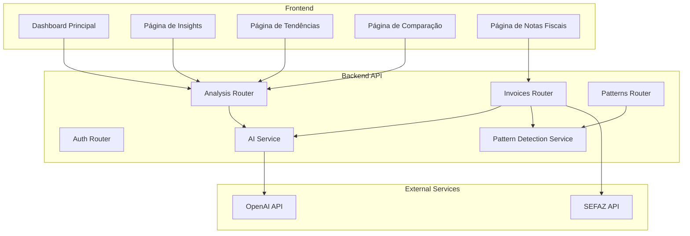

# Plano de Implementação: Analista de Compras SMarket

## Visão Geral

O objetivo é criar um sistema completo de "analista de compras" que avalia as notas fiscais do usuário e fornece feedback inteligente para ajudar na tomada de decisões de compra.

## Estado Atual

### Backend (FastAPI) - Parcialmente Implementado
- ✅ Autenticação JWT completa
- ✅ Modelos SQLAlchemy para: User, Invoice, InvoiceItem, Merchant, Product, Category, Analysis, PurchasePattern
- ✅ Parsers para XML e QR Code de notas fiscais
- ✅ Routers básicos para CRUD de invoices, merchants, categories, products
- ✅ Router de análise com endpoints de dashboard e tendências
- ✅ Configuração OpenAI (mas sem integração ativa)
- ❌ **FALTA**: Serviço de IA para gerar análises
- ❌ **FALTA**: Serviço de detecção de padrões de compra
- ❌ **FALTA**: Integração de IA no upload de notas
- ❌ **FALTA**: Sistema de alertas automáticos

### Frontend - Não Implementado
- ❌ **FALTA**: Aplicação web completa

## Arquitetura Proposta



## Fase 1: Backend - Serviços de IA e Padrões

### 1.1 Serviço de IA para Análises (`apps/api/src/services/ai_analyzer.py`)

**Responsabilidades:**
- Gerar insights de gastos por categoria
- Comparar preços com histórico
- Identificar oportunidades de economia
- Gerar recomendações personalizadas
- Analisar tendências de gastos

**Funções principais:**
```python
async def analyze_invoice(invoice_data: dict, user_history: dict) -> List[Analysis]
async def analyze_spending_patterns(user_id: uuid.UUID, period: int) -> List[Analysis]
async def compare_prices(product_id: uuid.UUID, user_id: uuid.UUID) -> Analysis
async def generate_recommendations(user_id: uuid.UUID) -> List[Analysis]
async def detect_price_alerts(invoice_data: dict, user_history: dict) -> List[Analysis]
```

**Tipos de análises geradas:**
1. `spending_pattern` - Padrões de gastos identificados
2. `price_alert` - Alertas de preços acima da média
3. `category_insight` - Insights por categoria
4. `merchant_pattern` - Padrões por estabelecimento
5. `recommendation` - Recomendações de economia
6. `summary` - Resumos de gastos

### 1.2 Serviço de Detecção de Padrões (`apps/api/src/services/pattern_detector.py`)

**Responsabilidades:**
- Detectar compras recorrentes de produtos
- Identificar visitas frequentes a estabelecimentos
- Detectar padrões de dia/hora de compra
- Identificar padrões sazonais
- Calcular previsão de próxima compra

**Funções principais:**
```python
async def detect_recurring_products(user_id: uuid.UUID) -> List[PurchasePattern]
async def detect_recurring_merchants(user_id: uuid.UUID) -> List[PurchasePattern]
async def detect_time_patterns(user_id: uuid.UUID) -> List[PurchasePattern]
async def detect_seasonal_patterns(user_id: uuid.UUID) -> List[PurchasePattern]
async def predict_next_purchase(pattern_id: uuid.UUID) -> datetime
```

### 1.3 Integração no Upload de Notas

**Modificações em `apps/api/src/routers/invoices.py`:**
- Após criar invoice e products, chamar serviços de IA
- Gerar análises automaticamente para cada nota
- Atualizar padrões de compra do usuário

**Fluxo:**
```
Upload Nota → Parser → Criar Invoice → Gerar Análises IA → Atualizar Padrões → Retornar
```

### 1.4 Sistema de Alertas Automáticos

**Novo endpoint em `apps/api/src/routers/analysis.py`:**
```python
@router.post("/generate", response_model=List[AnalysisResponse])
async def generate_analyses(
    current_user: User = Depends(get_current_user),
    db: AsyncSession = Depends(get_db)
)
```

**Background task (usando Celery ou FastAPI BackgroundTasks):**
- Executar análise periódica de gastos
- Detectar anomalias de preço
- Gerar alertas de compras recorrentes

## Fase 2: Backend - Novos Endpoints

### 2.1 Endpoint de Comparação de Preços

**Novo router: `apps/api/src/routers/price_comparison.py`**

```python
@router.get("/products/{product_id}/history")
async def get_product_price_history(product_id: uuid.UUID)

@router.get("/merchants/{merchant_id}/comparison")
async def compare_merchant_prices(merchant_id: uuid.UUID)

@router.get("/categories/{category_id}/trends")
async def get_category_price_trends(category_id: uuid.UUID)
```

### 2.2 Endpoint de Recomendações

**Novo router: `apps/api/src/routers/recommendations.py`**

```python
@router.get("/")
async def get_recommendations(user_id: uuid.UUID)

@router.post("/{recommendation_id}/accept")
async def accept_recommendation(recommendation_id: uuid.UUID)

@router.post("/{recommendation_id}/dismiss")
async def dismiss_recommendation(recommendation_id: uuid.UUID)
```

### 2.3 Endpoint de Alertas

**Novo router: `apps/api/src/routers/alerts.py`**

```python
@router.get("/")
async def get_alerts(user_id: uuid.UUID)

@router.post("/{alert_id}/acknowledge")
async def acknowledge_alert(alert_id: uuid.UUID)

@router.post("/configure")
async def configure_alerts(config: AlertConfig)
```

## Fase 3: Frontend - Next.js + React

### 3.1 Estrutura do Projeto

```
apps/web/
├── src/
│   ├── app/
│   │   ├── layout.tsx
│   │   ├── page.tsx (Dashboard)
│   │   ├── invoices/
│   │   │   ├── page.tsx
│   │   │   └── [id]/page.tsx
│   │   ├── insights/
│   │   │   └── page.tsx
│   │   ├── trends/
│   │   │   └── page.tsx
│   │   ├── comparison/
│   │   │   └── page.tsx
│   │   └── alerts/
│   │       └── page.tsx
│   ├── components/
│   │   ├── dashboard/
│   │   │   ├── SummaryCards.tsx
│   │   │   ├── SpendingChart.tsx
│   │   │   ├── RecentInvoices.tsx
│   │   │   └── InsightsList.tsx
│   │   ├── insights/
│   │   │   ├── InsightCard.tsx
│   │   │   ├── PriceAlert.tsx
│   │   │   └── Recommendation.tsx
│   │   ├── trends/
│   │   │   ├── TrendChart.tsx
│   │   │   ├── CategoryBreakdown.tsx
│   │   │   └── MerchantComparison.tsx
│   │   ├── comparison/
│   │   │   ├── PriceHistoryChart.tsx
│   │   │   ├── MerchantComparisonTable.tsx
│   │   │   └── BestPriceIndicator.tsx
│   │   └── shared/
│   │       ├── InvoiceUpload.tsx
│   │       ├── InvoiceList.tsx
│   │       └── LoadingSpinner.tsx
│   ├── lib/
│   │   ├── api.ts (cliente HTTP)
│   │   ├── auth.ts (gerenciamento de autenticação)
│   │   └── utils.ts
│   ├── hooks/
│   │   ├── useInvoices.ts
│   │   ├── useInsights.ts
│   │   ├── useTrends.ts
│   │   └── useAlerts.ts
│   └── types/
│       └── api.ts (tipos TypeScript)
├── public/
└── package.json
```

### 3.2 Dashboard Principal

**Componentes:**
- Cards de resumo (gastos do mês, mudança %, top merchant, insights não lidos)
- Gráfico de gastos mensais (últimos 6 meses)
- Lista de insights recentes (priorizados por criticidade)
- Lista de notas fiscais recentes
- Alertas ativos

**APIs utilizadas:**
- `GET /api/v1/analysis/dashboard/summary`
- `GET /api/v1/analysis/spending-trends/data`
- `GET /api/v1/analysis/`
- `GET /api/v1/invoices/`

### 3.3 Página de Insights

**Componentes:**
- Filtros por tipo (spending_pattern, price_alert, category_insight, etc.)
- Filtros por prioridade (critical, high, medium, low)
- Cards de insights com ações (marcar como lido, descartar, aceitar recomendação)
- Detalhes expandidos com dados estruturados

**APIs utilizadas:**
- `GET /api/v1/analysis/`
- `POST /api/v1/analysis/{id}/read`
- `POST /api/v1/analysis/{id}/dismiss`

### 3.4 Página de Tendências

**Componentes:**
- Gráfico de gastos por categoria (pie chart)
- Gráfico de gastos por merchant (bar chart)
- Gráfico de tendência temporal (line chart)
- Tabela de categorias com % de gastos
- Tabela de merchants com ticket médio

**APIs utilizadas:**
- `GET /api/v1/analysis/spending-trends/data`
- `GET /api/v1/analysis/merchant-insights/data`
- `GET /api/v1/categories/`
- `GET /api/v1/merchants/`

### 3.5 Página de Comparação de Preços

**Componentes:**
- Seletor de produto
- Gráfico de histórico de preços
- Tabela comparativa de merchants
- Indicador de melhor preço
- Alerta de preço acima da média

**APIs utilizadas:**
- `GET /api/v1/price-comparison/products/{id}/history`
- `GET /api/v1/price-comparison/merchants/{id}/comparison`
- `GET /api/v1/products/`

### 3.6 Página de Notas Fiscais

**Componentes:**
- Upload de XML
- Upload de QR Code (URL)
- Lista de notas fiscais
- Detalhes da nota (produtos, valores)
- Análises associadas à nota

**APIs utilizadas:**
- `GET /api/v1/invoices/`
- `GET /api/v1/invoices/{id}`
- `POST /api/v1/invoices/upload/xml`
- `POST /api/v1/invoices/qrcode`
- `DELETE /api/v1/invoices/{id}`

## Fase 4: Integração e Testes

### 4.1 Testes de Integração

**Arquivos de teste:**
- `apps/api/tests/test_ai_analyzer.py`
- `apps/api/tests/test_pattern_detector.py`
- `apps/api/tests/test_price_comparison.py`
- `apps/api/tests/test_recommendations.py`

### 4.2 Testes E2E (Frontend)

**Ferramenta:** Playwright ou Cypress

**Cenários de teste:**
- Upload de nota fiscal e geração de insights
- Visualização de dashboard
- Navegação entre páginas
- Marcação de insights como lidos
- Aceitação de recomendações

## Fase 5: Deploy

### 5.1 Docker Compose

**Serviços:**
- API (FastAPI)
- PostgreSQL
- Redis (para cache e filas)
- Frontend (Next.js)

### 5.2 CI/CD

**GitHub Actions:**
- Testes automatizados
- Build de Docker images
- Deploy automático em staging/produção

## Priorização de Implementação

### Alta Prioridade (MVP)
1. ✅ Backend básico (já existe)
2. 🔲 Serviço de IA para análises
3. 🔲 Integração de IA no upload de notas
4. 🔲 Frontend básico (dashboard + upload de notas)
5. 🔲 Página de insights

### Média Prioridade
6. 🔲 Serviço de detecção de padrões
7. 🔲 Página de tendências
8. 🔲 Sistema de alertas automáticos
9. 🔲 Página de comparação de preços

### Baixa Prioridade
10. 🔲 Recomendações avançadas
11. 🔲 Padrões sazonais
12. 🔲 Previsão de compras
13. 🔲 Notificações push/email

## Tecnologias

### Backend
- FastAPI 0.109.0
- SQLAlchemy 2.0.25
- PostgreSQL
- OpenAI API (gpt-4o-mini)
- Celery (para background tasks)
- Redis (para cache/filas)

### Frontend
- Next.js 14 (App Router)
- React 18
- TypeScript
- Tailwind CSS
- shadcn/ui (componentes)
- Recharts (gráficos)
- Axios (cliente HTTP)
- React Query (cache de dados)

## Considerações Importantes

### Performance
- Cache de análises geradas (Redis)
- Paginação em todas as listas
- Lazy loading de componentes
- Otimização de queries SQL

### Segurança
- Rate limiting na API
- Validação rigorosa de uploads
- Sanitização de dados do usuário
- Criptografia de dados sensíveis

### UX
- Feedback visual imediato após upload
- Animações suaves
- Design responsivo (mobile-first)
- Modo escuro/claro

### Escalabilidade
- Arquitetura modular
- Separação de concerns
- Background tasks para operações pesadas
- Horizontal scaling com Docker/Kubernetes
