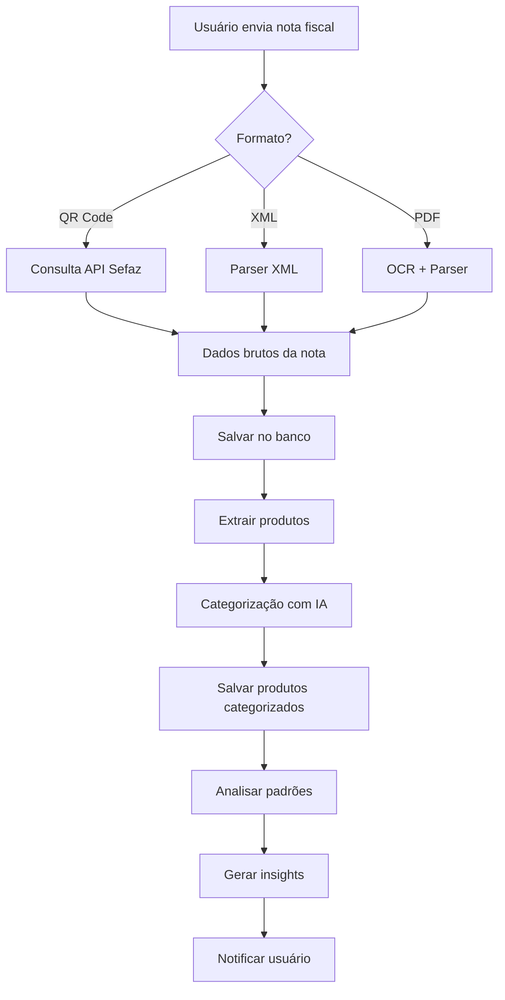

# Mercado Esperto - Analisador de Notas Fiscais

## Visão Geral

Aplicativo web que permite aos usuários adicionar notas fiscais e receber análises inteligentes sobre seus padrões de compra, funcionando como um "analista de compras" pessoal.

## Funcionalidades Principais

### 1. Entrada de Notas Fiscais
- **QR Code**: Leitura de QR codes de notas fiscais brasileiras (NFC-e)
- **Upload XML**: Processamento de arquivos XML de NF-e/NFC-e
- **Upload PDF**: OCR para extrair dados de notas fiscais em PDF

### 2. Análise Inteligente
- **Categorização automática**: Classificação de produtos em categorias (alimentação, transporte, vestuário, etc.)
- **Detecção de padrões**: Identificação de compras recorrentes e comportamentos
- **Insights personalizados**: Alertas sobre gastos anormais e sugestões de economia
- **Evolução temporal**: Gráficos de gastos ao longo do tempo

### 3. Dashboard
- Visão geral de gastos por categoria
- Histórico de compras
- Alertas e notificações
- Relatórios mensais

## Stack Tecnológica

### Frontend
- **Next.js 14** (App Router)
- **TypeScript**
- **Tailwind CSS**
- **shadcn/ui** (componentes)
- **Recharts** (gráficos)

### Backend
- **Python 3.11+**
- **FastAPI**
- **PostgreSQL** (via SQLAlchemy)
- **Alembic** (migrations)
- **Pydantic** (validação)

### Processamento de Dados
- **xml.etree** (parser XML)
- **requests** (consulta API Sefaz)
- **PyPDF2** + **pytesseract** (OCR)
- **OpenAI API** (categorização e insights)

### Autenticação
- **NextAuth.js** (frontend)
- **JWT** (backend)

### Deploy
- **Vercel** (frontend)
- **Railway/Render** (backend Python)
- **Supabase** (PostgreSQL)

## Estrutura do Monorepo

```
mercadoesperto/
├── apps/
│   ├── web/                    # Next.js frontend
│   │   ├── src/
│   │   │   ├── app/           # App Router
│   │   │   ├── components/    # Componentes React
│   │   │   ├── lib/           # Utilitários
│   │   │   └── types/         # Tipos TypeScript
│   │   ├── public/
│   │   └── package.json
│   │
│   └── api/                    # FastAPI backend
│       ├── src/
│       │   ├── models/        # Modelos SQLAlchemy
│       │   ├── schemas/       # Schemas Pydantic
│       │   ├── routers/       # Rotas da API
│       │   ├── services/      # Lógica de negócio
│       │   ├── parsers/       # Parsers de notas fiscais
│       │   ├── ai/            # Integração com OpenAI
│       │   ├── database.py    # Configuração do banco
│       │   └── main.py        # Entry point
│       ├── alembic/           # Migrations
│       ├── tests/
│       └── requirements.txt
│
├── packages/
│   └── shared-types/          # Tipos compartilhados (opcional)
│
├── docker-compose.yml         # Para desenvolvimento local
└── README.md
```

## Modelos de Dados

### Usuário (User)
- id (UUID)
- email
- nome
- created_at
- updated_at

### Nota Fiscal (Invoice)
- id (UUID)
- user_id (FK)
- chave_acesso (chave da NFC-e/NF-e)
- numero
- serie
- data_emissao
- cnpj_emitente
- nome_emitente
- valor_total
- tipo (NFC-e, NF-e)
- xml_data (JSON)
- created_at

### Produto (Product)
- id (UUID)
- invoice_id (FK)
- codigo
- descricao
- quantidade
- unidade
- valor_unitario
- valor_total
- categoria_id (FK, nullable)

### Categoria (Category)
- id (UUID)
- nome (ex: "Alimentação", "Transporte")
- cor (para gráficos)
- icone
- user_id (FK, nullable - categorias padrão vs personalizadas)

### Análise (Analysis)
- id (UUID)
- user_id (FK)
- tipo (padrao, insight, alerta)
- titulo
- descricao
- dados (JSON - dados específicos da análise)
- data_referencia
- created_at

## Fluxo de Processamento de Nota Fiscal



## APIs Externas

### Consulta NFC-e (Sefaz)
- Endpoint: Varia por estado
- Exemplo SP: `https://www.nfce.fazenda.sp.gov.br/NFCeConsultaPublica/Paginas/ConsultaPublica.aspx`
- Ou uso de APIs de terceiros como Focus NFe

### OpenAI
- Modelo: GPT-4o-mini
- Uso: Categorização de produtos e geração de insights

## Funcionalidades de Análise

### 1. Categorização Inteligente
```python
# Exemplo de prompt para OpenAI
"""
Categorize os seguintes produtos de uma nota fiscal em uma dessas categorias:
- Alimentação
- Bebidas
- Limpeza
- Higiene pessoal
- Vestuário
- Eletrônicos
- Farmácia
- Transporte
- Lazer
- Outros

Produtos:
1. ARROZ TIPO 1 5KG
2. SABÃO EM PÓ 1KG
3. CERVEJA LATA 350ML

Responda em formato JSON.
"""
```

### 2. Detecção de Padrões
- Compras recorrentes (mesmo produto, mesma periodicidade)
- Compras no mesmo estabelecimento
- Horários de compra
- Dias da semana

### 3. Insights e Alertas
- "Você comprou [produto] 3 vezes neste mês"
- "Seus gastos com [categoria] aumentaram 40% em relação ao mês passado"
- "Você frequenta a loja [nome] toda [dia da semana]"
- "Sua compra habitual é de R$ X, mas desta vez foi R$ Y"

## Segurança

- Autenticação JWT
- Dados sensíveis criptografados
- Validação de input
- Rate limiting nas APIs
- CORS configurado

## Próximos Passos

1. Configurar estrutura do monorepo
2. Criar backend FastAPI com modelos iniciais
3. Configurar frontend Next.js
4. Implementar parser de XML de notas fiscais
5. Criar integração com OpenAI
6. Desenvolver dashboard inicial
