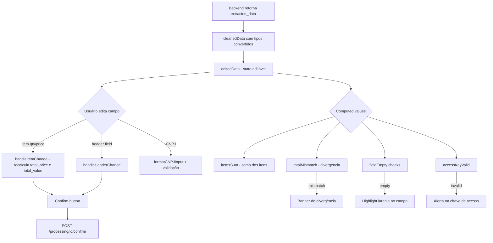

# Plano: Melhorias UX na Tela de Revisão de Nota Fiscal

## Contexto

A pipeline de extração já foi reescrita (tasks 1-6 do [plano original](invoice-extraction-improvements.md)):
- Prompt com few-shot, regras de formatação, self-check
- Validação pós-extração (CNPJ, access_key, totais, confiança)
- Multi-imagem em request única
- Categorização separada
- `max_tokens=4096`, `temperature=0.0`

O backend agora emite **warnings estruturados** e ajusta **confiança automaticamente**. Este plano foca em expor esses dados de forma útil na tela de revisão.

**Arquivo principal:** `apps/web/src/app/invoices/review/[processingId]/page.tsx`

---

## Estado Atual da Tela

A tela já possui:
- ✅ Stamp de confiança (cor/label baseado no score)
- ✅ Seção de warnings (amber)
- ✅ Validação de CNPJ com formatação
- ✅ Enriquecimento de CNPJ via BrasilAPI/ReceitaWS
- ✅ Auto-recálculo de `total_value` ao editar `quantity`/`unit_price`
- ✅ Badge de contagem de imagens

**O que falta:**
- ❌ Destaque visual em campos vazios/problemáticos
- ❌ Indicador de divergência entre soma dos itens e total
- ❌ Botão explícito "Recalcular Total"
- ❌ Mapeamento entre warnings e campos específicos
- ❌ Indicador visual na coluna "Total" quando recalculado pelo backend
- ❌ Botão para remover/adicionar itens

---

## Mudanças Propostas

### 1. Banner de divergência soma × total

Adicionar um banner amarelo/vermelho calculado em tempo real acima da seção de Total.

```
┌──────────────────────────────────────────────────┐
│  ⚠ Soma dos itens (R$ 142.30) ≠ Total (R$ 150.75)  │
│    Diferença: R$ 8.45                                │
│    [Usar Soma dos Itens]  [Manter Total Original]    │
└──────────────────────────────────────────────────┘
```

**Lógica:**
- Calcular `itemsSum = items.reduce((sum, item) => sum + item.total_price, 0)`
- Se `Math.abs(itemsSum - total_value) > 0.01` → mostrar banner
- Botão "Usar Soma dos Itens" atualiza `total_value = itemsSum`
- Separar "Recalcular Total" como botão no footer da seção de Total

**Implementação:** Computed value acima da div `.mb-8.border-t-2` (seção Total, ~linha 496 do `page.tsx`)

---

### 2. Highlight de campos vazios/problemáticos

Adicionar borda vermelha/amarela + ícone em campos que vieram vazios ou com problemas.

| Campo | Condição de alerta | Estilo |
|---|---|---|
| `access_key` | Vazio ou length ≠ 44 dígitos | Borda laranja, placeholder em itálico |
| `issuer_cnpj` | Vazio ou length ≠ 14 dígitos | Borda laranja (já tem para validação) |
| `issuer_name` | Vazio | Borda laranja |
| `number` | Vazio | Borda laranja |
| `issue_date` | Vazio | Borda laranja |

**Implementação:**
- Criar helper `fieldHasWarning(field: string): boolean` que checa se o campo está vazio
- Adicionar classe condicional: `border-amber-400 bg-amber-50` quando campo vazio/problemático
- Para `access_key`, contar dígitos e mostrar texto de ajuda se ≠ 44

---

### 3. Indicador de item recalculado

Quando o backend recalcula `total_price` (warning contém "total recalculado"), sinalizar na coluna "TOTAL" dos itens.

**Implementação:**
- Verificar se `Math.abs(item.quantity * item.unit_price - item.total_price) > 0.02`
- Se sim, mostrar tooltip ou ícone ⟳ ao lado do valor

---

### 4. Botões de adicionar/remover item

Permitir que o usuário adicione itens que a LLM não capturou ou remova duplicatas.

- **Botão "+" ao final da tabela** → adiciona item vazio
- **Botão "×" em cada linha** → remove item (com confirmação se items > 1)

**Implementação:**
- `handleAddItem()`: push novo `{ description: '', quantity: 1, unit: 'UN', unit_price: 0, total_price: 0 }` + recalcular total
- `handleRemoveItem(index)`: splice + recalcular total
- Nova coluna estreita na tabela para o botão ×

---

### 5. Melhorar seção de warnings com ações

Os warnings vindos do backend devem ser mais acionáveis:

| Warning pattern | Ação sugerida |
|---|---|
| "CNPJ com X dígitos" | Link/scroll para campo CNPJ |
| "Chave de acesso não encontrada" | Highlight no campo access_key |
| "Divergência entre total" | Botão "Usar soma dos itens" |
| "X item(ns) com total recalculado" | Indicar quais itens |

**Implementação:** Parsear texto dos warnings e adicionar botões/links contextuais.

---

## Ordem de Implementação

| # | Tarefa | Impacto | Complexidade |
|---|--------|---------|-------------|
| 1 | Banner de divergência soma × total | Alto | Baixa |
| 2 | Highlight de campos vazios | Alto | Baixa |
| 3 | Botões adicionar/remover item | Médio | Baixa |
| 4 | Indicador de item recalculado | Baixo | Trivial |
| 5 | Warnings com ações contextuais | Médio | Média |

---

## Detalhes Técnicos

### Computed values necessários

```typescript
// No corpo do componente, após editedData estar disponível:

const itemsSum = editedData.items.reduce(
  (sum, item) => sum + (Number(item.total_price) || 0), 0
);

const totalMismatch = Math.abs(itemsSum - Number(editedData.total_value)) > 0.01;

const isFieldEmpty = (value: string | undefined | null): boolean =>
  !value || value.trim() === '';

const accessKeyValid = (editedData.access_key || '').replace(/\D/g, '').length === 44;
```

### Novos handlers

```typescript
const handleAddItem = () => {
  if (!editedData) return;
  const newItems = [...editedData.items, {
    description: '',
    quantity: 1,
    unit: 'UN',
    unit_price: 0,
    total_price: 0,
  }];
  const newTotal = newItems.reduce((sum, item) => sum + (Number(item.total_price) || 0), 0);
  setEditedData({ ...editedData, items: newItems, total_value: newTotal });
};

const handleRemoveItem = (index: number) => {
  if (!editedData || editedData.items.length <= 1) return;
  const newItems = editedData.items.filter((_, i) => i !== index);
  const newTotal = newItems.reduce((sum, item) => sum + (Number(item.total_price) || 0), 0);
  setEditedData({ ...editedData, items: newItems, total_value: newTotal });
};

const handleUseItemsSum = () => {
  if (!editedData) return;
  setEditedData({ ...editedData, total_value: itemsSum });
};
```

### Classes CSS condicionais para campos

```typescript
// Helper para estilo de campo
const fieldStyle = (value: string | undefined | null): string => {
  if (isFieldEmpty(value)) {
    return 'border-amber-400 bg-amber-50/50';
  }
  return 'border-transparent';
};
```

---

## Diagrama: Fluxo de Dados na Tela de Revisão



---

## Fora de Escopo deste plano

- **Unificação de pipelines** (`image_parser.py` vs `multi_provider_extractor.py`) — ver plano separado
- **Testes automatizados** — priorizar testes manuais via Docker primeiro
- **Internacionalização** — manter tudo em PT-BR por ora
- **Dark mode** — manter tema claro atual
