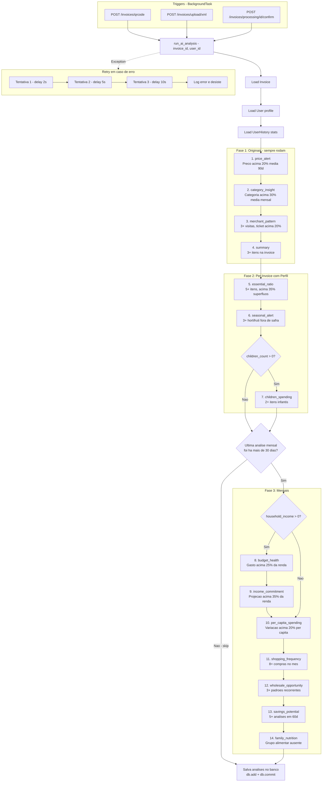

```mermaid
flowchart TD
    subgraph TRIGGERS["Triggers - BackgroundTask"]
        T1["POST /invoices/qrcode"]
        T2["POST /invoices/upload/xml"]
        T3["POST /invoices/processing/id/confirm"]
    end

    T1 --> RUN
    T2 --> RUN
    T3 --> RUN

    RUN["run_ai_analysis - invoice_id, user_id"]
    RUN --> L1

    L1["Load Invoice"] --> L2["Load User profile"] --> L3["Load UserHistory stats"]
    L3 --> A1

    subgraph PHASE1["Fase 1: Originais - sempre rodam"]
        A1["1. price_alert\nPreco acima 20% media 90d"]
        A2["2. category_insight\nCategoria acima 30% media mensal"]
        A3["3. merchant_pattern\n3+ visitas, ticket acima 20%"]
        A4["4. summary\n3+ itens na invoice"]
        A1 --> A2 --> A3 --> A4
    end

    A4 --> A5

    subgraph PHASE2["Fase 2: Per-Invoice com Perfil"]
        A5["5. essential_ratio\n5+ itens, acima 35% superfluos"]
        A6["6. seasonal_alert\n3+ hortifruti fora de safra"]
        A7{"children_count > 0?"}
        A7a["7. children_spending\n2+ itens infantis"]
        A5 --> A6 --> A7
        A7 -- Sim --> A7a
    end

    A7 -- Nao --> CHK
    A7a --> CHK

    CHK{"Ultima analise mensal\nfoi ha mais de 30 dias?"}
    CHK -- "Nao - skip" --> PERSIST

    CHK -- Sim --> INC

    subgraph PHASE3["Fase 3: Mensais"]
        INC{"household_income > 0?"}
        A8["8. budget_health\nGasto acima 25% da renda"]
        A9["9. income_commitment\nProjecao acima 35% da renda"]
        A10["10. per_capita_spending\nVariacao acima 20% per capita"]
        A11["11. shopping_frequency\n8+ compras no mes"]
        A12["12. wholesale_opportunity\n3+ padroes recorrentes"]
        A13["13. savings_potential\n5+ analises em 60d"]
        A14["14. family_nutrition\nGrupo alimentar ausente"]
        INC -- Sim --> A8 --> A9 --> A10
        INC -- Nao --> A10
        A10 --> A11 --> A12 --> A13 --> A14
    end

    A14 --> PERSIST

    PERSIST["Salva analises no banco\ndb.add + db.commit"]

    RUN -. "Exception" .-> RETRY
    subgraph RETRY["Retry em caso de erro"]
        R1["Tentativa 1 - delay 2s"]
        R2["Tentativa 2 - delay 5s"]
        R3["Tentativa 3 - delay 10s"]
        R4["Log error e desiste"]
        R1 --> R2 --> R3 --> R4
    end
```
