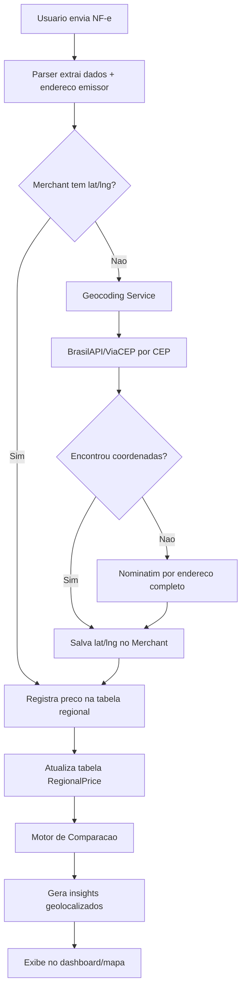
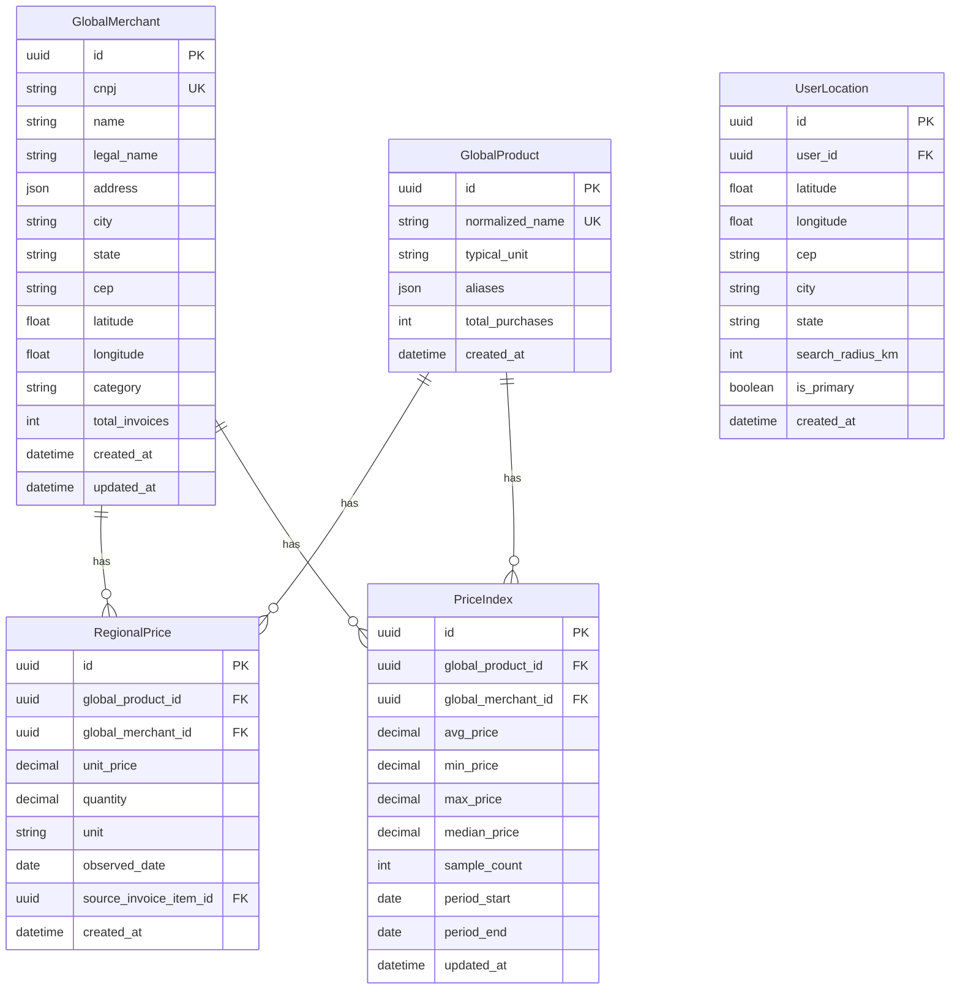
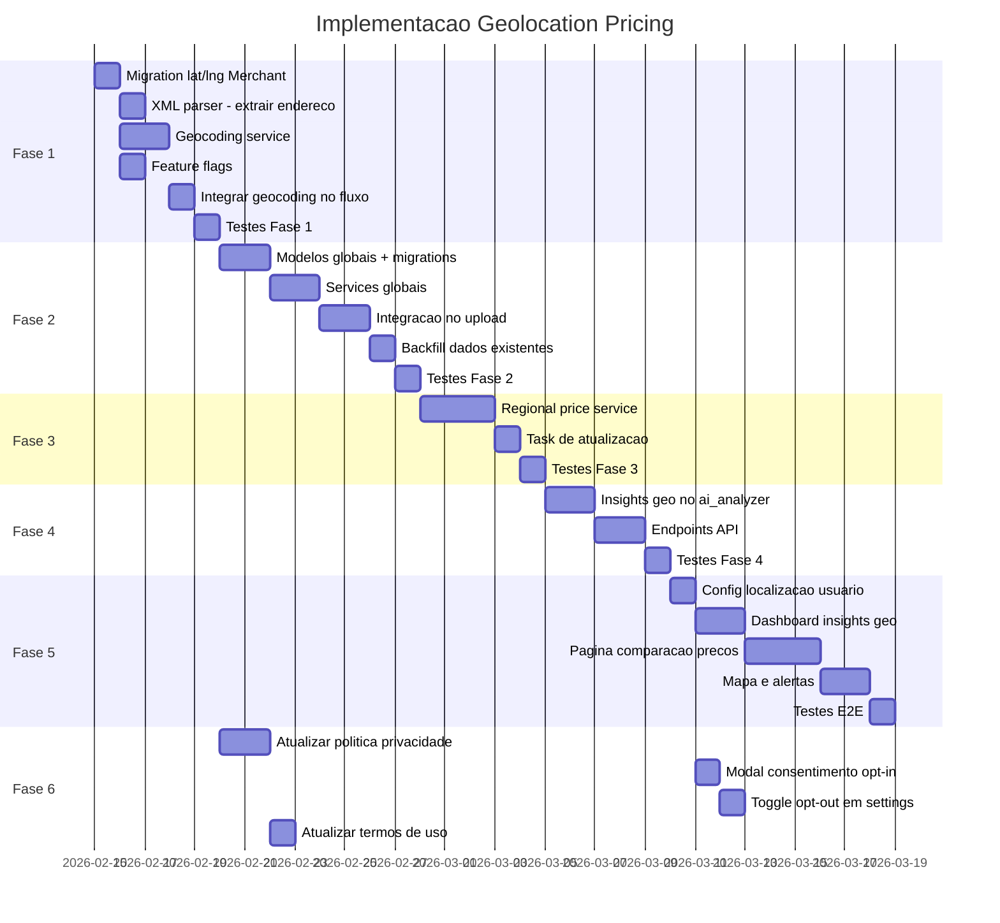

# Geolocalização e Comparação de Preços Regionais

## Visão Geral

Implementar um sistema de inteligência de preços baseado em geolocalização que, à medida que os usuários adicionam notas fiscais, constrói um mapa de preços regionais. O sistema identifica onde produtos estão mais baratos/caros e gera insights personalizados como:

> "Clientes próximos a você compraram arroz mais barato no Mercado X — R$ 10,00 vs R$ 15,00 que você pagou"

### Princípios

- **Privacidade**: Dados são agregados e anonimizados — nenhum usuário vê compras de outro
- **Crowdsourcing**: Quanto mais usuários na região, melhores os insights
- **Gradual**: Feature flag para rollout controlado
- **Geocoding gratuito**: BrasilAPI/ViaCEP + Nominatim como fontes de coordenadas

---

## Arquitetura

### Diagrama de Fluxo



### Diagrama de Dados



---

## Fase 1 — Infraestrutura de Geolocalização

### 1.1 Adicionar coordenadas ao Merchant

Adicionar campos `latitude` e `longitude` ao modelo [`Merchant`](apps/api/src/models/merchant.py) existente e ao campo `cep`:

```python
# Novos campos no Merchant
cep: Mapped[Optional[str]] = mapped_column(String(8), nullable=True)
latitude: Mapped[Optional[float]] = mapped_column(Float, nullable=True)
longitude: Mapped[Optional[float]] = mapped_column(Float, nullable=True)
geocoded_at: Mapped[Optional[datetime]] = mapped_column(nullable=True)
```

**Migration**: Alembic migration para adicionar os campos.

### 1.2 Extrair endereço do XML da NF-e

O [`xml_parser.py`](apps/api/src/parsers/xml_parser.py) atualmente NÃO extrai o endereço do emissor. A tag `enderEmit` no XML contém:

```xml
<enderEmit>
    <xLgr>Rua Exemplo</xLgr>
    <nro>123</nro>
    <xBairro>Centro</xBairro>
    <cMun>3550308</cMun>
    <xMun>Sao Paulo</xMun>
    <UF>SP</UF>
    <CEP>01001000</CEP>
</enderEmit>
```

Modificar o parser para extrair esses dados e retorná-los no dict de resultado.

### 1.3 Serviço de Geocoding

Criar `apps/api/src/services/geocoding_service.py`:

```python
async def geocode_by_cep(cep: str) -> Optional[tuple[float, float]]:
    """Geocoding via BrasilAPI/ViaCEP - retorna lat, lng"""
    ...

async def geocode_by_address(address: str, city: str, state: str) -> Optional[tuple[float, float]]:
    """Fallback via Nominatim/OpenStreetMap"""
    ...

async def geocode_merchant(merchant: Merchant) -> Optional[tuple[float, float]]:
    """Tenta geocodificar um merchant usando CEP primeiro, depois endereço"""
    ...
```

**Estratégia de geocoding**:
1. Tentar BrasilAPI por CEP — rápido e preciso para localização por bairro
2. Fallback para Nominatim com endereço completo
3. Cache de resultados por CEP (mesmo CEP = mesmas coordenadas)
4. Rate limiting para respeitar limites das APIs gratuitas

### 1.4 Feature Flags

Adicionar ao [`config.py`](apps/api/src/config.py):

```python
# Geolocation Features
ENABLE_GEOLOCATION_FEATURES: bool = False
ENABLE_GEOCODING: bool = True
ENABLE_REGIONAL_PRICING: bool = True
GEOCODING_CACHE_TTL: int = 2592000  # 30 dias
DEFAULT_SEARCH_RADIUS_KM: int = 10
```

### Tarefas da Fase 1

- [ ] Criar migration para adicionar `cep`, `latitude`, `longitude`, `geocoded_at` ao Merchant
- [ ] Modificar XML parser para extrair `enderEmit`
- [ ] Criar `geocoding_service.py` com BrasilAPI + Nominatim
- [ ] Integrar geocoding no fluxo de criação/enriquecimento de Merchant
- [ ] Adicionar feature flags de geolocalização ao `config.py`
- [ ] Adicionar variáveis ao `.env.example` e `docker-compose.yml`
- [ ] Testes unitários para geocoding service
- [ ] Backfill: script para geocodificar merchants existentes

---

## Fase 2 — Entidades Globais e Preços Regionais

### 2.1 Tabela GlobalMerchant

Atualmente, cada [`Merchant`](apps/api/src/models/merchant.py) é vinculado a um `user_id`. Para comparação cross-user, precisamos de uma entidade global baseada no CNPJ:

```python
class GlobalMerchant(Base):
    __tablename__ = "global_merchants"

    id: Mapped[uuid.UUID] = mapped_column(primary_key=True, default=uuid.uuid4)
    cnpj: Mapped[str] = mapped_column(String(14), unique=True, index=True)
    name: Mapped[str] = mapped_column(String(255))
    legal_name: Mapped[Optional[str]] = mapped_column(String(255), nullable=True)
    address: Mapped[Optional[dict]] = mapped_column(JSON, nullable=True)
    city: Mapped[Optional[str]] = mapped_column(String(100), nullable=True)
    state: Mapped[Optional[str]] = mapped_column(String(2), nullable=True)
    cep: Mapped[Optional[str]] = mapped_column(String(8), nullable=True)
    latitude: Mapped[Optional[float]] = mapped_column(Float, nullable=True)
    longitude: Mapped[Optional[float]] = mapped_column(Float, nullable=True)
    category: Mapped[Optional[str]] = mapped_column(String(50), nullable=True)
    total_invoices: Mapped[int] = mapped_column(Integer, default=0)
    created_at: Mapped[datetime] = mapped_column(default=datetime.utcnow)
    updated_at: Mapped[datetime] = mapped_column(default=datetime.utcnow, onupdate=datetime.utcnow)
```

**Relação com Merchant existente**: Adicionar `global_merchant_id` FK ao Merchant per-user, criando um link entre o merchant do usuário e o merchant global.

### 2.2 Tabela GlobalProduct

Produtos globais para matching cross-user:

```python
class GlobalProduct(Base):
    __tablename__ = "global_products"

    id: Mapped[uuid.UUID] = mapped_column(primary_key=True, default=uuid.uuid4)
    normalized_name: Mapped[str] = mapped_column(String(255), unique=True, index=True)
    typical_unit: Mapped[Optional[str]] = mapped_column(String(10), nullable=True)
    aliases: Mapped[list] = mapped_column(JSON, default=list)
    total_purchases: Mapped[int] = mapped_column(Integer, default=0)
    created_at: Mapped[datetime] = mapped_column(default=datetime.utcnow)
```

### 2.3 Tabela RegionalPrice

Registro individual de preço observado — a matéria-prima dos insights:

```python
class RegionalPrice(Base):
    __tablename__ = "regional_prices"

    id: Mapped[uuid.UUID] = mapped_column(primary_key=True, default=uuid.uuid4)
    global_product_id: Mapped[uuid.UUID] = mapped_column(ForeignKey("global_products.id"))
    global_merchant_id: Mapped[uuid.UUID] = mapped_column(ForeignKey("global_merchants.id"))
    unit_price: Mapped[Decimal] = mapped_column(Numeric(15, 2))
    quantity: Mapped[Decimal] = mapped_column(Numeric(15, 3))
    unit: Mapped[str] = mapped_column(String(10))
    observed_date: Mapped[date] = mapped_column(Date)
    source_invoice_item_id: Mapped[uuid.UUID] = mapped_column(ForeignKey("invoice_items.id"))
    created_at: Mapped[datetime] = mapped_column(default=datetime.utcnow)
```

**Índices importantes**:
- `(global_product_id, global_merchant_id, observed_date)` — busca de preços por produto/merchant
- `(global_product_id, observed_date)` — busca de preços por produto em período

### 2.4 Tabela PriceIndex (materializada)

Agregação pré-calculada para performance:

```python
class PriceIndex(Base):
    __tablename__ = "price_indexes"

    id: Mapped[uuid.UUID] = mapped_column(primary_key=True, default=uuid.uuid4)
    global_product_id: Mapped[uuid.UUID] = mapped_column(ForeignKey("global_products.id"))
    global_merchant_id: Mapped[uuid.UUID] = mapped_column(ForeignKey("global_merchants.id"))
    avg_price: Mapped[Decimal] = mapped_column(Numeric(15, 2))
    min_price: Mapped[Decimal] = mapped_column(Numeric(15, 2))
    max_price: Mapped[Decimal] = mapped_column(Numeric(15, 2))
    median_price: Mapped[Decimal] = mapped_column(Numeric(15, 2))
    sample_count: Mapped[int] = mapped_column(Integer)
    period_start: Mapped[date] = mapped_column(Date)
    period_end: Mapped[date] = mapped_column(Date)
    updated_at: Mapped[datetime] = mapped_column(default=datetime.utcnow)
```

### 2.5 Tabela UserLocation

Localização do usuário para busca de proximidade:

```python
class UserLocation(Base):
    __tablename__ = "user_locations"

    id: Mapped[uuid.UUID] = mapped_column(primary_key=True, default=uuid.uuid4)
    user_id: Mapped[uuid.UUID] = mapped_column(ForeignKey("users.id"))
    latitude: Mapped[float] = mapped_column(Float)
    longitude: Mapped[float] = mapped_column(Float)
    cep: Mapped[Optional[str]] = mapped_column(String(8), nullable=True)
    city: Mapped[Optional[str]] = mapped_column(String(100), nullable=True)
    state: Mapped[Optional[str]] = mapped_column(String(2), nullable=True)
    search_radius_km: Mapped[int] = mapped_column(Integer, default=10)
    is_primary: Mapped[bool] = mapped_column(Boolean, default=True)
    created_at: Mapped[datetime] = mapped_column(default=datetime.utcnow)
```

### Tarefas da Fase 2

- [ ] Criar modelo `GlobalMerchant` e migration
- [ ] Criar modelo `GlobalProduct` e migration
- [ ] Criar modelo `RegionalPrice` e migration
- [ ] Criar modelo `PriceIndex` e migration
- [ ] Criar modelo `UserLocation` e migration
- [ ] Adicionar `global_merchant_id` FK ao Merchant existente
- [ ] Criar schemas Pydantic para todas as novas entidades
- [ ] Criar service `global_merchant_service.py` — upsert por CNPJ
- [ ] Criar service `global_product_service.py` — matching por normalized_name
- [ ] Integrar no fluxo de upload de invoice: popular GlobalMerchant, GlobalProduct e RegionalPrice
- [ ] Script de backfill para dados existentes
- [ ] Testes unitários

---

## Fase 3 — Motor de Comparação de Preços

### 3.1 Serviço de Comparação Regional

Criar `apps/api/src/services/regional_price_service.py`:

```python
class RegionalPriceService:
    async def find_cheaper_alternatives(
        self,
        product_name: str,
        user_location: UserLocation,
        current_price: Decimal,
        db: AsyncSession,
    ) -> list[CheaperAlternative]:
        """
        Encontra merchants proximos onde o produto esta mais barato.
        Usa formula Haversine para calculo de distancia.
        """
        ...

    async def get_regional_price_stats(
        self,
        product_id: uuid.UUID,
        latitude: float,
        longitude: float,
        radius_km: int,
        days: int = 30,
        db: AsyncSession,
    ) -> RegionalPriceStats:
        """
        Estatisticas de preco de um produto na regiao.
        Retorna: media, min, max, mediana, merchants com melhor preco.
        """
        ...

    async def detect_overpriced_items(
        self,
        invoice_items: list[InvoiceItem],
        merchant_location: tuple[float, float],
        radius_km: int,
        db: AsyncSession,
    ) -> list[OverpricedItem]:
        """
        Detecta itens da nota que estao acima da media regional.
        """
        ...

    async def update_price_indexes(
        self,
        db: AsyncSession,
    ) -> None:
        """
        Recalcula PriceIndex para todos os produtos/merchants.
        Executado periodicamente via task.
        """
        ...
```

### 3.2 Cálculo de Distância (Haversine)

Para evitar dependência do PostGIS, usar fórmula Haversine em SQL:

```sql
-- Distancia em km entre dois pontos
SELECT *,
    6371 * acos(
        cos(radians(:lat)) * cos(radians(latitude)) *
        cos(radians(longitude) - radians(:lng)) +
        sin(radians(:lat)) * sin(radians(latitude))
    ) AS distance_km
FROM global_merchants
WHERE latitude IS NOT NULL
HAVING distance_km <= :radius
ORDER BY distance_km;
```

**Nota**: Se o volume de dados crescer muito, considerar migrar para PostGIS com índice GiST.

### 3.3 Task de Atualização de Índices

Criar `apps/api/src/tasks/update_price_indexes.py`:
- Executar periodicamente (diário ou a cada X horas)
- Recalcular `PriceIndex` para produtos com novos dados
- Limpar dados antigos (> 90 dias por padrão)

### Tarefas da Fase 3

- [ ] Criar `regional_price_service.py` com métodos de comparação
- [ ] Implementar cálculo Haversine em SQLAlchemy
- [ ] Criar `update_price_indexes.py` task
- [ ] Criar schemas para respostas de comparação de preços
- [ ] Testes unitários com dados mock de geolocalização
- [ ] Testes de performance com volume de dados simulado

---

## Fase 4 — Insights Geolocalizados

### 4.1 Novo Tipo de Análise

Adicionar ao [`ai_analyzer.py`](apps/api/src/services/ai_analyzer.py) um novo tipo de análise `geo_price_comparison`:

```python
# Novo tipo de insight
if settings.is_analysis_enabled("geo_price_comparison"):
    geo_insights = await self._generate_geo_price_insights(
        invoice=invoice,
        items=items,
        merchant=merchant,
        db=db,
    )
    analyses.extend(geo_insights)
```

### 4.2 Tipos de Insights Geolocalizados

| Tipo | Descrição | Exemplo |
|------|-----------|---------|
| `cheaper_nearby` | Produto mais barato em merchant próximo | Arroz 5kg por R$ 10 no Mercado X, 2km de voce. Voce pagou R$ 15 |
| `overpriced_alert` | Produto muito acima da média regional | Leite esta 40% acima da media na sua regiao |
| `best_merchant` | Merchant com melhores preços gerais | Mercado Y tem os melhores precos para sua lista de compras habitual |
| `price_drop` | Queda de preço detectada em merchant próximo | Cafe caiu 20% no Mercado Z esta semana |
| `regional_trend` | Tendência de preço na região | Precos de hortifruti subiram 15% na sua regiao este mes |

### 4.3 Feature Flag

```python
ENABLE_ANALYSIS_GEO_PRICE_COMPARISON: bool = True
```

### 4.4 Endpoints da API

Novos endpoints em `apps/api/src/routers/regional_prices.py`:

```
GET  /api/v1/regional-prices/compare?product={name}&lat={lat}&lng={lng}&radius={km}
GET  /api/v1/regional-prices/cheapest?product={name}&lat={lat}&lng={lng}
GET  /api/v1/regional-prices/stats?product={name}&lat={lat}&lng={lng}&radius={km}
GET  /api/v1/regional-prices/overpriced?invoice_id={id}
POST /api/v1/user-location  — salvar localização do usuário
GET  /api/v1/user-location  — obter localização salva
PUT  /api/v1/user-location/{id}  — atualizar raio de busca
```

### Tarefas da Fase 4

- [ ] Adicionar feature flag `ENABLE_ANALYSIS_GEO_PRICE_COMPARISON`
- [ ] Implementar geração de insights geo no `ai_analyzer.py`
- [ ] Criar router `regional_prices.py` com endpoints de comparação
- [ ] Criar router/endpoints para `UserLocation`
- [ ] Criar schemas Pydantic para respostas dos endpoints
- [ ] Testes de integração para os novos endpoints
- [ ] Documentar novos endpoints

---

## Fase 5 — Frontend

### 5.1 Configuração de Localização do Usuário

- Página em `/settings` para o usuário informar seu CEP ou permitir geolocalização do navegador/app
- Campo de raio de busca configurável (5km, 10km, 20km, 50km)

### 5.2 Insights no Dashboard

- Cards de insight geolocalizado no dashboard existente
- Badge "Economia potencial" mostrando quanto o usuário poderia economizar
- Link para ver detalhes da comparação

### 5.3 Página de Comparação de Preços

Nova página `/prices` ou `/prices/compare`:
- Busca por produto
- Lista de merchants próximos com preços
- Ordenação por preço ou distância
- Mapa simples mostrando merchants (usando Leaflet/OpenStreetMap — gratuito)

### 5.4 Detalhes da Invoice com Alertas Geo

Na página de detalhes da invoice (`/invoices/[id]`):
- Indicador visual em itens que estão acima da média regional
- Tooltip com "Encontrado mais barato no Mercado X por R$ Y"

### Tarefas da Fase 5

- [ ] Criar componente de configuração de localização em `/settings`
- [ ] Criar hooks `useRegionalPrices` e `useUserLocation`
- [ ] Adicionar cards de insight geo no dashboard
- [ ] Criar página `/prices/compare` com busca e lista
- [ ] Integrar mapa com Leaflet/OpenStreetMap
- [ ] Adicionar alertas geo na página de detalhes da invoice
- [ ] Testes E2E para fluxos de geolocalização
- [ ] Responsividade mobile (Capacitor)

---

## Fase 6 — Atualização da Política de Privacidade e Termos

A política de privacidade atual em [`apps/web/src/app/privacy/page.tsx`](apps/web/src/app/privacy/page.tsx) precisa ser atualizada para cobrir os novos tratamentos de dados introduzidos pela feature de geolocalização.

### 6.1 Alterações na Política de Privacidade

A seção **1. Dados Coletados** precisa incluir:
- Dados de localização do usuário (CEP ou coordenadas, quando fornecidos voluntariamente)
- Dados de endereço dos estabelecimentos (extraídos das notas fiscais e APIs públicas)

A seção **2. Uso dos Dados** precisa incluir:
- Comparação de preços regionais entre estabelecimentos próximos
- Geração de insights baseados em localização geográfica
- Agregação anônima de dados de preços para benefício da comunidade de usuários

Adicionar nova seção **"Dados Agregados e Anonimizados"**:
- Explicar que dados de preços são agregados de forma anônima para criar índices regionais
- Nenhum dado pessoal do comprador é vinculado aos preços regionais
- Outros usuários nunca veem suas compras individuais — apenas médias e estatísticas
- O usuário pode optar por não participar da agregação de dados (opt-out)

A seção **4. Compartilhamento de Dados** precisa ser atualizada:
- Esclarecer que dados de preços são agregados anonimamente entre usuários
- Reforçar que dados pessoais (nome, email, compras individuais) NUNCA são compartilhados

A seção **5. Serviços de Terceiros** precisa incluir:
- BrasilAPI/ViaCEP para consulta de endereços por CEP
- Nominatim/OpenStreetMap para geocodificação de endereços
- Esclarecer que apenas CEP e endereço do estabelecimento são enviados (não dados do usuário)

### 6.2 Consentimento e Opt-in/Opt-out

Implementar mecanismo de consentimento:
- **Opt-in**: Na primeira vez que o usuário acessa a feature, exibir modal explicando:
  - Como seus dados de preço serão usados anonimamente
  - Que sua localização é necessária para insights regionais
  - Botão "Aceitar e participar" / "Não quero participar"
- **Opt-out**: Em `/settings`, toggle para desativar:
  - Compartilhamento anônimo de preços
  - Insights baseados em localização
- Salvar preferência no campo `preferences` do [`User`](apps/api/src/models/user.py:39)

### 6.3 Termos de Uso

Verificar e atualizar [`apps/web/src/app/terms/page.tsx`](apps/web/src/app/terms/) se necessário, incluindo:
- Descrição da feature de comparação de preços regionais
- Disclaimer de que preços são informativos e podem estar desatualizados
- Que a precisão depende da quantidade de dados na região

### Tarefas da Fase 6

- [ ] Atualizar seção 1 da política de privacidade (Dados Coletados)
- [ ] Atualizar seção 2 (Uso dos Dados)
- [ ] Adicionar seção sobre Dados Agregados e Anonimizados
- [ ] Atualizar seção 4 (Compartilhamento de Dados)
- [ ] Atualizar seção 5 (Serviços de Terceiros)
- [ ] Implementar modal de consentimento opt-in no frontend
- [ ] Adicionar toggle de opt-out em `/settings`
- [ ] Salvar preferências de geolocalização no User.preferences
- [ ] Atualizar termos de uso se necessário
- [ ] Atualizar data de "Última atualização" na página

---

## Considerações Técnicas

### Privacidade e LGPD

- **Dados agregados**: A tabela `RegionalPrice` armazena preços sem vincular ao usuário comprador
- **Anonimização**: O `source_invoice_item_id` é usado apenas para deduplicação, nunca exposto na API
- **Consentimento**: O usuário deve optar por compartilhar dados de preço (opt-in)
- **Localização**: O usuário informa manualmente o CEP ou permite geolocalização — nunca rastreamento automático

### Performance

- **PriceIndex**: Tabela materializada para evitar queries pesadas em tempo real
- **Cache**: Redis para cache de geocoding e consultas frequentes
- **Índices**: Índices compostos nas tabelas de preço para queries eficientes
- **Haversine vs PostGIS**: Começar com Haversine puro; migrar para PostGIS se necessário

### Escalabilidade

- **Volume estimado**: ~100 preços por invoice × milhares de invoices = milhões de registros
- **Particionamento**: Considerar particionamento por `observed_date` na `RegionalPrice`
- **Agregação assíncrona**: `PriceIndex` atualizado via task, não em tempo real

### Rate Limiting de APIs

- **BrasilAPI/ViaCEP**: ~1 req/s — cache agressivo por CEP
- **Nominatim**: 1 req/s — usar apenas como fallback
- **Fila de geocoding**: Processar geocoding em background, não bloquear upload

---

## Ordem de Implementação Recomendada



---

## Resumo de Arquivos a Criar/Modificar

### Novos Arquivos

| Arquivo | Descrição |
|---------|-----------|
| `apps/api/src/models/global_merchant.py` | Modelo GlobalMerchant |
| `apps/api/src/models/global_product.py` | Modelo GlobalProduct |
| `apps/api/src/models/regional_price.py` | Modelo RegionalPrice |
| `apps/api/src/models/price_index.py` | Modelo PriceIndex |
| `apps/api/src/models/user_location.py` | Modelo UserLocation |
| `apps/api/src/schemas/regional_price.py` | Schemas de preço regional |
| `apps/api/src/schemas/user_location.py` | Schemas de localização |
| `apps/api/src/services/geocoding_service.py` | Serviço de geocoding |
| `apps/api/src/services/global_merchant_service.py` | Serviço de merchant global |
| `apps/api/src/services/global_product_service.py` | Serviço de produto global |
| `apps/api/src/services/regional_price_service.py` | Motor de comparação |
| `apps/api/src/routers/regional_prices.py` | Endpoints de preço regional |
| `apps/api/src/routers/user_locations.py` | Endpoints de localização |
| `apps/api/src/tasks/update_price_indexes.py` | Task de atualização |
| `apps/web/src/hooks/use-regional-prices.ts` | Hook de preços regionais |
| `apps/web/src/hooks/use-user-location.ts` | Hook de localização |
| `apps/web/src/app/prices/` | Página de comparação |

### Arquivos Modificados

| Arquivo | Modificação |
|---------|-------------|
| [`apps/api/src/models/merchant.py`](apps/api/src/models/merchant.py) | Adicionar `cep`, `latitude`, `longitude`, `geocoded_at`, `global_merchant_id` |
| [`apps/api/src/models/__init__.py`](apps/api/src/models/__init__.py) | Registrar novos modelos |
| [`apps/api/src/parsers/xml_parser.py`](apps/api/src/parsers/xml_parser.py) | Extrair `enderEmit` |
| [`apps/api/src/services/ai_analyzer.py`](apps/api/src/services/ai_analyzer.py) | Novo tipo de análise geo |
| [`apps/api/src/config.py`](apps/api/src/config.py) | Feature flags de geolocalização |
| [`apps/api/src/main.py`](apps/api/src/main.py) | Registrar novos routers |
| [`apps/api/src/routers/invoices.py`](apps/api/src/routers/invoices.py) | Integrar com GlobalMerchant/RegionalPrice no upload |
| [`apps/api/src/schemas/merchant.py`](apps/api/src/schemas/merchant.py) | Adicionar campos geo |
| [`apps/web/src/types/index.ts`](apps/web/src/types/index.ts) | Novos tipos TypeScript |
| [`apps/web/src/lib/api.ts`](apps/web/src/lib/api.ts) | Novos endpoints |
| [`apps/web/src/app/privacy/page.tsx`](apps/web/src/app/privacy/page.tsx) | Atualizar política de privacidade com dados de geolocalização |
| [`apps/web/src/app/terms/page.tsx`](apps/web/src/app/terms/) | Atualizar termos de uso |
| [`apps/web/src/app/settings/`](apps/web/src/app/settings/) | Toggle de opt-out para geolocalização |
| `.env.example` | Novas variáveis de configuração |
| `docker-compose.yml` | Novas variáveis de ambiente |
