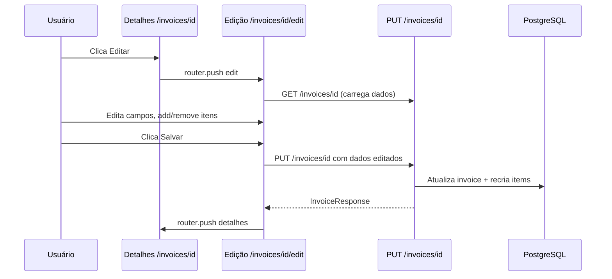

# Plano: Edição de Notas Fiscais Confirmadas

## Problema

Após uma nota fiscal ser confirmada na etapa de revisão, ela se torna **somente leitura**. A página de detalhes (`/invoices/[invoiceId]`) não possui botão de edição, a página de edição (`/invoices/[invoiceId]/edit/`) está vazia, e o backend não possui endpoints PUT/PATCH para atualizar notas existentes. O usuário não consegue corrigir dados nem adicionar/remover itens de uma NF já salva.

## O que já existe

| Camada | Componente | Estado |
|--------|-----------|--------|
| Backend | `PUT /invoices/{id}` | ❌ Não existe |
| Backend | Schemas de atualização | ❌ Não existem |
| Frontend | Página de detalhes | ✅ Read-only, sem botão "Editar" |
| Frontend | Página de edição (`edit/page.tsx`) | ❌ Diretório vazio |
| Frontend | Hook `useUpdateInvoice` | ❌ Não existe |
| Frontend | Review page (referência de UX) | ✅ Tem edição, add/remove itens |

## Arquitetura da Solução



## Tarefas

### Task 1 — Backend: Schema de atualização

Arquivo: `apps/api/src/schemas/invoice.py`

Criar `InvoiceUpdate` e `InvoiceItemUpdate`:

```python
class InvoiceItemUpdate(BaseModel):
    id: Optional[uuid.UUID] = None  # None = novo item
    code: Optional[str] = None
    description: str
    quantity: Decimal
    unit: str = "UN"
    unit_price: Decimal
    total_price: Decimal
    category_name: Optional[str] = None
    subcategory: Optional[str] = None

class InvoiceUpdate(BaseModel):
    number: Optional[str] = None
    series: Optional[str] = None
    issue_date: Optional[datetime] = None
    issuer_name: Optional[str] = None
    issuer_cnpj: Optional[str] = None
    total_value: Optional[Decimal] = None
    access_key: Optional[str] = None
    items: Optional[list[InvoiceItemUpdate]] = None
```

### Task 2 — Backend: Endpoint PUT /invoices/{id}

Arquivo: `apps/api/src/routers/invoices.py`

Criar rota `PUT /invoices/{invoice_id}`:

- Recebe `InvoiceUpdate`
- Busca invoice do usuário autenticado
- Atualiza campos do header que vieram no request (não-None)
- Se `items` foi enviado:
  - Deleta todos os `InvoiceItem` existentes do invoice
  - Recria com os novos dados (estratégia replace-all — mais simples e evita bugs de merge parcial)
- Valida CNPJ se `issuer_cnpj` mudou e validação estiver habilitada
- Limpa `access_key` (remove espaços, mantém 44 chars)
- Retorna `InvoiceResponse` atualizado

### Task 3 — Frontend: Hook `useUpdateInvoice`

Arquivo: `apps/web/src/hooks/use-invoices.ts`

```typescript
export function useUpdateInvoice(): UseMutationResult<Invoice, Error, { id: string; data: InvoiceUpdate }> {
  const queryClient = useQueryClient();
  return useMutation({
    mutationFn: async ({ id, data }) => {
      return apiClient.put<Invoice>(`/invoices/${id}`, data);
    },
    onSuccess: (_, variables) => {
      void queryClient.invalidateQueries({ queryKey: INVOICE_KEYS.detail(variables.id) });
      void queryClient.invalidateQueries({ queryKey: INVOICE_KEYS.lists() });
    },
  });
}
```

Também adicionar o tipo `InvoiceUpdate` em `types/index.ts`.

### Task 4 — Frontend: Página de edição `/invoices/[invoiceId]/edit/page.tsx`

Criar a página de edição reutilizando o padrão visual da review page.

Comportamento:
- Carrega dados via `useInvoice(invoiceId)`
- Converte `products[]` → state editável `items[]`
- Campos editáveis: `issuer_name`, `issuer_cnpj`, `number`, `series`, `issue_date`, `access_key`
- Tabela de itens com todos os campos (CÓD, descrição, qtd, un, categoria, subcategoria, preço un., total)
- Botão `+ ADICIONAR ITEM` (mesma UX da review page)
- Botão `×` para remover item (mínimo 1 item)
- Banner de divergência de soma (mesma lógica da review page)
- Botões: `SALVAR ALTERAÇÕES` (chama `useUpdateInvoice`) e `CANCELAR` (volta para detalhes)
- Validação de CNPJ com `formatCNPJInput` / `getCNPJErrorMessage`
- Botão de consultar CNPJ (enriquecimento)

### Task 5 — Frontend: Botão "Editar" na página de detalhes

Arquivo: `apps/web/src/app/invoices/[invoiceId]/page.tsx`

Adicionar botão "Editar" ao lado de "Exportar" e "Deletar":

```tsx
<Button
  variant="outline"
  size="sm"
  leftIcon={<Pencil className="size-4" />}
  onClick={() => { router.push(`/invoices/${invoiceId}/edit`); }}
>
  Editar
</Button>
```

## Decisões técnicas

| Decisão | Justificativa |
|---------|--------------|
| Estratégia replace-all para items | Mais simples que diff/merge parcial. Evita bugs com itens órfãos. O `cascade="all, delete-orphan"` no SQLAlchemy já lida com deleção automática. |
| Página separada `/edit` vs modal | Edição de NF é complexa (muitos campos + tabela). Página dedicada oferece melhor experiência. |
| Reutilizar UX da review page | O usuário já conhece a interface de edição do fluxo de revisão. Manter consistência. |
| PUT (substituição completa) vs PATCH | PUT é mais previsível. O frontend envia sempre o estado completo dos items. |

## Fora do escopo

- Histórico de edições / auditoria
- Edição inline na tela de detalhes (seria feito em iteração futura)
- Edição em lote de múltiplas NFs
