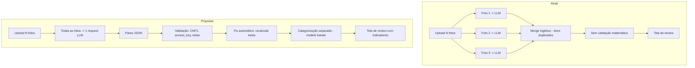

# Plano: Melhorias na Extração de Notas Fiscais

## Diagnóstico dos Problemas Atuais

Analisei toda a pipeline: prompt → LLM → parse → merge → review → confirm. Identifiquei **7 problemas raiz** organizados por impacto.

---

### Problema 1: Prompt vago e sem exemplos concretos

**Arquivo:** `apps/api/src/services/multi_provider_extractor.py` (SYSTEM_PROMPT, linha ~70)

O prompt atual diz "extraia os campos em JSON" mas:
- Não mostra um exemplo concreto de NFC-e (few-shot)
- Não explica a estrutura visual de uma NFC-e (onde ficam os campos)
- Não diz que CNPJ tem formato `XX.XXX.XXX/XXXX-XX` na nota mas deve retornar **só dígitos**
- Não diz que `number` é o número impresso no cabeçalho da nota (ex: "Nº 001234")
- Não diz que `access_key` é a sequência de 44 dígitos geralmente no rodapé
- Pede `category_name` e `subcategory` no mesmo passo da extração OCR, sobrecarregando a LLM

**Impacto:** CNPJ vem com pontuação, número da nota confuso com outros números, access_key errada.

---

### Problema 2: Somas não batem — sem validação pós-extração

**Arquivo:** `apps/api/src/services/multi_provider_extractor.py` (parse_invoice_response, linha ~21)

Depois que a LLM retorna o JSON, o código simplesmente faz `ExtractedInvoiceData(**data)` sem **nenhuma validação matemática**:
- Não verifica se `sum(item.total_price) ≈ total_value`
- Não verifica se `item.quantity × item.unit_price ≈ item.total_price`
- Não reconstrói totais quando há inconsistência
- LLMs frequentemente erram decimais (ex: 1.50 vira 150, ou 15.0 vira 1.50)

**Impacto:** Totais incorretos, itens com preços errados.

---

### Problema 3: Merge de múltiplas imagens é ingênuo

**Arquivo:** `apps/api/src/tasks/process_invoice_photos.py` (_merge_extracted_data, linha ~200)

Quando o usuário envia 3 fotos da mesma NFC-e:
- Cada foto é processada **independentemente** (prompt não sabe das outras fotos)
- O merge simplesmente **concatena todos os itens** de todas as extrações
- Itens que aparecem em mais de uma foto ficam **duplicados**
- Usa `base = all_extracted[0]` para cabeçalho — se a primeira foto não tiver o cabeçalho, perde
- Não há deduplicação por descrição + preço

**Impacto:** Itens duplicados, total inflado, dados de cabeçalho perdidos.

---

### Problema 4: Duas pipelines paralelas e desalinhadas

Existem **duas rotas de upload de imagem completamente diferentes**:

| | `POST /upload/photos` | `POST /upload/images` |
|---|---|---|
| Parser | `multi_provider_extractor.py` (LangChain) | `image_parser.py` (OpenAI direto) |
| Prompt | SYSTEM_PROMPT (sem exemplo) | EXTRACTION_SYSTEM_PROMPT (ligeiramente melhor) |
| Schema saída | `ExtractedInvoiceData` | Dict normalizado |
| Processamento | Background task | Síncrono |
| Multi-imagem | Cada imagem separada + merge | Todas as imagens em 1 request |

O `image_parser.py` tem a abordagem **muito melhor** para multi-imagem (manda todas na mesma request), mas o fluxo principal (`/upload/photos`) não usa isso.

**Impacto:** Comportamentos inconsistentes, manutenção duplicada.

---

### Problema 5: max_tokens insuficiente

**Arquivo:** `multi_provider_extractor.py` — Gemini, OpenAI e Anthropic usam `max_tokens=2048`

Uma NFC-e de supermercado pode ter 30-50 itens. O JSON de 40 itens facilmente passa de 3000 tokens. Com 2048 tokens, a resposta é **cortada no meio**, causando JSON inválido ou itens faltando.

OpenRouter já usa 4096, mas os demais extractors não.

**Impacto:** Itens cortados no final da lista, JSON malformado.

---

### Problema 6: Confiança sempre 0.95

A LLM sempre retorna `confidence: 0.95` porque o prompt não define critérios claros. Isso torna o indicador de confiança inútil para o usuário na tela de review.

**Impacto:** Falsa sensação de qualidade na tela de revisão.

---

### Problema 7: access_key gerado como placeholder

**Arquivo:** `image_parser.py` (_normalize_invoice_data, linha ~114)

Se a LLM não encontra a chave de acesso, o código gera um timestamp de 44 dígitos como placeholder. Isso **mascara o problema** — o usuário não sabe que a chave é falsa, e o sistema pode ter duplicatas.

**Impacto:** Chaves de acesso falsas no banco.

---

## Plano de Ação

### Etapa 1: Reescrever o prompt com few-shot e regras claras

**Arquivos:** `apps/api/src/services/multi_provider_extractor.py`

1. Adicionar um exemplo concreto de input/output (few-shot) no prompt
2. Separar claramente: campos de cabeçalho vs. itens
3. Instruções explícitas para formatos:
   - CNPJ: retornar **somente 14 dígitos**, sem pontuação
   - access_key: retornar **somente 44 dígitos**, sem espaços
   - number: o número da NF-e visível no cabeçalho (ignorar outros números)
   - issue_date: ISO 8601 convertido do formato dd/mm/yyyy HH:MM:SS da nota
4. Remover `category_name` e `subcategory` do prompt de extração — categorização deve ser um segundo passo
5. Adicionar instrução de self-check: "Verifique se a soma dos total_price dos itens é igual ao total_value"
6. Definir critérios claros para o campo `confidence`

**Novo prompt proposto:**

```
Você é um especialista em OCR de notas fiscais brasileiras (NFC-e/NF-e).
Analise a imagem e extraia os dados estruturados.

REGRAS DE FORMATAÇÃO:
- CNPJ: retorne SOMENTE os 14 dígitos, sem pontos/barras/hífens
- Chave de acesso: retorne SOMENTE os 44 dígitos, sem espaços
- Número da nota: o número impresso após "NFC-e Nº" ou "NF-e Nº"
- Data: converta do formato brasileiro (dd/mm/aaaa HH:MM) para ISO 8601
- Valores: use ponto como separador decimal (ex: 15.90, não 15,90)

VERIFICAÇÃO OBRIGATÓRIA:
- Confira que a soma de todos os total_price dos itens é igual (ou muito próxima) ao total_value
- Se não bater, recalcule os total_price como quantity × unit_price

CONFIANÇA:
- 0.9+: todos os campos legíveis, valores conferem
- 0.7-0.9: alguns campos ilegíveis ou valores com pequena divergência
- <0.7: imagem parcial, muitos campos ilegíveis

Retorne APENAS JSON válido, sem markdown:
{
  "access_key": "string de 44 dígitos ou vazio se ilegível",
  "number": "número da nota fiscal",
  "series": "série (default: '1')",
  "issue_date": "2024-01-15T14:30:00",
  "issuer_name": "nome do estabelecimento",
  "issuer_cnpj": "14 dígitos sem pontuação",
  "total_value": 150.75,
  "items": [
    {
      "description": "LEITE INTEGRAL PARMALAT 1L",
      "quantity": 2.0,
      "unit": "UN",
      "unit_price": 5.99,
      "total_price": 11.98
    }
  ],
  "confidence": 0.92,
  "warnings": ["chave de acesso parcialmente ilegível"]
}
```

---

### Etapa 2: Adicionar validação pós-extração

**Arquivo:** `apps/api/src/services/multi_provider_extractor.py`

Criar função `validate_and_fix_extraction()` chamada após `parse_invoice_response()`:

1. **Validar totais dos itens:** `item.quantity × item.unit_price ≈ item.total_price` (±0.02)
   - Se não bate, recalcular `total_price = quantity × unit_price`
2. **Validar total geral:** `sum(items.total_price) ≈ total_value` (±1.0)
   - Se o total dos itens é mais confiável (mais dígitos), usar ele
   - Se o total_value da nota é claramente diferente, adicionar warning
3. **Limpar CNPJ:** remover tudo que não é dígito, verificar se tem 14 chars
4. **Limpar access_key:** remover tudo que não é dígito, verificar se tem 44 chars
5. **Limpar number:** remover zeros à esquerda desnecessários, strip

---

### Etapa 3: Melhorar merge de múltiplas imagens

**Arquivo:** `apps/api/src/tasks/process_invoice_photos.py`

**Opção A (recomendada):** Enviar todas as imagens na mesma request à LLM
- Modificar `BaseInvoiceExtractor.extract()` para aceitar `List[bytes]`
- Construir uma mensagem com todas as imagens + instrução "são partes da mesma nota"
- Elimina completamente o problema de merge

**Opção B (fallback):** Melhorar o merge:
- Deduplicar itens por similaridade (description + unit_price)
- Para cabeçalho, iterar todas as extrações e usar a que tem mais campos preenchidos
- Para total_value, usar o valor que aparece mais vezes entre as extrações

---

### Etapa 4: Unificar as pipelines

**Arquivos:** `image_parser.py`, `multi_provider_extractor.py`, `invoices.py`

1. Deprecar `image_parser.py` — só é usado pela rota `/upload/images`
2. A rota `/upload/images` deve usar o `MultiProviderExtractor` 
3. Mover a lógica multi-imagem do `image_parser.py` para o extractor

---

### Etapa 5: Separar extração de categorização

**Novo arquivo:** `apps/api/src/services/categorizer.py`

1. Remover `category_name` e `subcategory` do prompt de extração
2. Criar segundo passo: depois de extrair e validar, enviar lista de itens para categorização
3. Isso melhora a qualidade da extração (LLM foca em OCR) e da categorização (LLM foca em classificação)
4. A categorização pode usar modelo mais barato (texto puro, sem imagem)

---

### Etapa 6: Aumentar max_tokens e ajustar temperature

**Arquivo:** `multi_provider_extractor.py`

- Todos os extractors: `max_tokens=4096` (hoje Gemini/OpenAI/Anthropic usam 2048)
- Considerar `temperature=0.0` em vez de `0.1` para OCR (zero criatividade)

---

### Etapa 7: Melhorar UX de revisão com indicadores de problema

**Arquivo:** `apps/web/src/app/invoices/review/[processingId]/page.tsx`

1. Destacar em vermelho campos com warning (access_key vazia, CNPJ incompleto)
2. Mostrar se `sum(items) ≠ total_value` com aviso visual
3. Indicar quais campos a LLM não conseguiu ler (veio vazio/default)
4. Botão "Recalcular Total" que soma os itens

---

## Ordem de Prioridade

| # | Etapa | Impacto | Complexidade |
|---|-------|---------|-------------|
| 1 | Reescrever prompt | **ALTO** | Baixa |
| 2 | Validação pós-extração | **ALTO** | Baixa |
| 6 | max_tokens + temperature | **ALTO** | Trivial |
| 3 | Multi-imagem na mesma request | **ALTO** | Média |
| 5 | Separar categorização | Médio | Média |
| 4 | Unificar pipelines | Médio | Média |
| 7 | UX de revisão | Médio | Baixa |

---

## Diagrama: Pipeline Atual vs. Proposta


