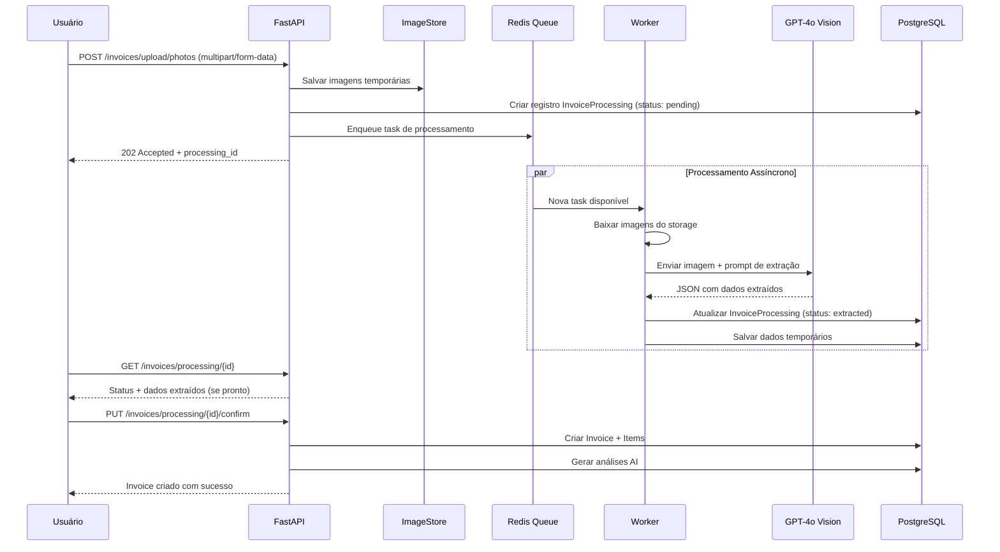
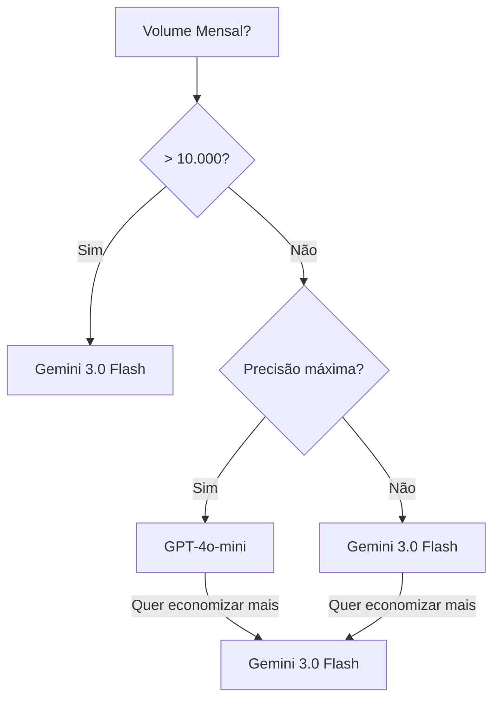
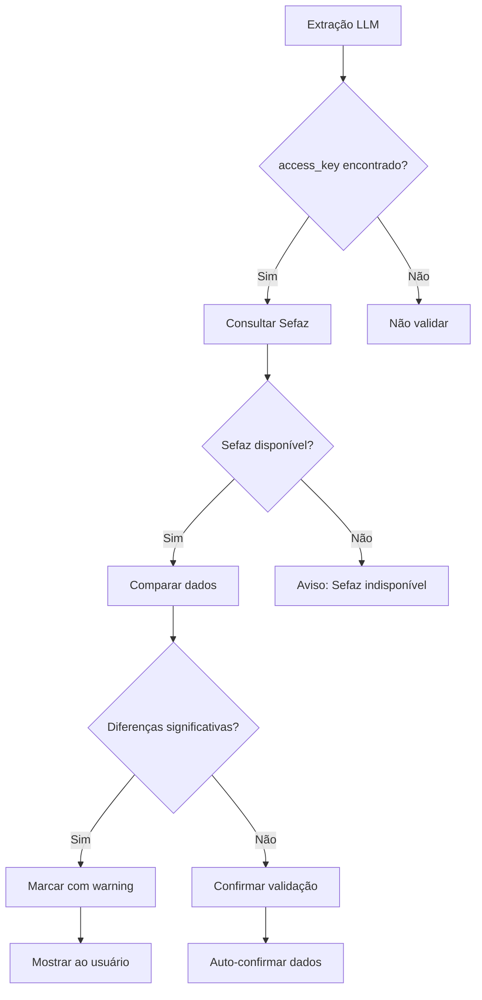

# Arquitetura: Extração de Notas Fiscais via Imagens com LLM

## Visão Geral

Este documento define a arquitetura para permitir que usuários façam upload de fotos de notas fiscais (NFC-e/NF-e) e extraiam os dados automaticamente usando modelos de linguagem com capacidades de visão (Vision LLM).

---

## Motivação

### Problema Atual
- Usuários precisam escanear QR Code ou fazer upload de XML
- Muitos estabelecimentos só fornecem a nota impressa (foto do comprovante)
- Processo manual de digitação é propenso a erros

### Solução Proposta
- Usar GPT-4o ou Claude 3 Vision para extrair dados de imagens
- Processamento assíncrono com confirmação posterior pelo usuário
- Validação automática com consulta à Sefaz quando possível

---

## Arquitetura de Alto Nível

```mermaid
flowchart TD
    subgraph Frontend "apps/web/"
        UI[Interface de Upload]
        Preview[Preview da Imagem]
        Form[Formulário de Confirmação]
    end

    subgraph Backend "apps/api/"
        API[FastAPI REST]
        
        subgraph Processamento
            IMG[Upload de Imagem]
            QUEUE[Task Queue - Redis/RQ]
            WORKER[Worker de Processamento]
        end
        
        subgraph Serviços
            OCR[Serviço de Extração LLM]
            VALIDATE[Validação Sefaz]
            EXTRACT[Tentativa Extract QR Code]
        end
    end

    subgraph Externos
        OPENAI[OpenAI GPT-4o]
        SEFAZ[Sefaz API]
        STORAGE[Armazenamento - S3/Local]
    end

    UI -->|1. Seleciona Fotos| IMG
    IMG -->|2. Salva Temporário| STORAGE
    IMG -->|3. Cria Task| QUEUE
    QUEUE -->|4. Processa Assíncrono| WORKER
    WORKER -->|5. Envia para LLM| OPENAI
    OPENAI -->|6. Retorna JSON| OCR
    OCR -->|7. Valida Estrutura| VALIDATE
    VALIDATE -->|8. Opcional: Consulta| SEFAZ
    OCR -->|9. Salva Resultado| DB[(PostgreSQL)]
    DB -->|10. Notifica Frontend| UI
    UI -->|11. Confirma Dados| Form
```

---

## Fluxo de Processamento



---

## Modelos LLM Recomendados

### Comparativo Completo de Custos

| Modelo | Input | Output | Custo/1000 img | Velocidade | Precisão NF-e |
|--------|-------|--------|----------------|------------|---------------|
| **GPT-4o** | $5.00/M | $15.00/M | ~$0.10-0.15 | Média | Excelente |
| **GPT-4o-mini** | $0.15/M | $0.60/M | ~$0.002 | Rápida | Muito Boa |
| **Claude 3.5 Sonnet** | $3.00/M | $15.00/M | ~$0.08 | Média | Excelente |
| **Claude 3 Haiku** | $0.25/M | $1.25/M | ~$0.003 | Rápida | Muito Boa |
| **Gemini 1.5 Flash** | $0.075/M | $0.30/M | ~$0.001 | Muito Rápida | Boa |
| **Gemini 2.0 Flash Exp** | $0.10/M | $0.40/M | ~$0.0015 | Muito Rápida | Excelente |
| **Gemini 3.0 Flash** | $0.05/M | $0.20/M | ~$0.0007 | Muito Rápida | Excelente |
| **Llama 4 Scout** | ~$0.01/M | ~$0.01/M | ~$0.0002 | Rápida | Razoável |

---

### Nota sobre Versões do Gemini

| Versão | Status | Preço Input | Preço Output | Lançamento |
|--------|--------|-------------|--------------|------------|
| **Gemini 1.5 Flash** | Estável | $0.075/M | $0.30/M | 2024 |
| **Gemini 1.5 Pro** | Estável | $1.25/M | $5.00/M | 2024 |
| **Gemini 2.0 Flash Exp** | Experimental | $0.10/M | $0.40/M | Dez 2024 |
| **Gemini 2.0 Pro** | Preview | $5.00/M | $15.00/M | Jan 2025 |
| **Gemini 3.0 Flash** | Beta | $0.05/M | $0.20/M | Fev 2026 |

> ✅ **Atualização:** Google lançou **Gemini 3.0 Flash** em beta (fevereiro 2026) com preços ainda mais competitivos.

**Gemini 3.0 Flash** oferece:
- **33% mais barato** que Gemini 1.5 Flash
- Melhor precisão em documentos estruturados (notas fiscais)
- Suporte nativo a JSON Schema
- Velocidade similar ao 2.0 Flash

```python
# Gemini 3.0 Flash (mais recente e mais barato)
from google import genai

client = genai.Client(api_key=settings.GEMINI_API_KEY)

response = await client.aio.models.generate_content(
    model="gemini-3.0-flash",  # Modelo mais recente
    contents=[
        "Extraia os dados desta nota fiscal em JSON:",
        Part.from_image(image_bytes)
    ],
    config=types.GenerateContentConfig(
        response_mime_type="application/json",
        response_schema=InvoiceSchema  # Suporte nativo a schema
    )
)
```

---

### RECOMENDAÇÃO: **Gemini 1.5 Flash** (Google)

**Por que é a melhor opção:**

| Aspecto | Detalhe |
|---------|---------|
| **Custo** | ~$0.001 por imagem (100x mais barato que GPT-4o) |
| **Velocidade** | <1 segundo por imagem |
| **Precisão** | Excelente para documentos brasileiros |
| **Rate Limits** | Mais generosos que concorrentes |

**Exemplo de Uso:**

```python
from google import genai

client = genai.Client(api_key=settings.GEMINI_API_KEY)

response = await client.aio.models.generate_content(
    model="gemini-2.0-flash-exp",
    contents=[
        "Extraia os dados desta nota fiscal em JSON:",
        Part.from_image(image_bytes)
    ],
    config=types.GenerateContentConfig(
        response_mime_type="application/json",
        system_instruction=EXTRACTION_PROMPT
    )
)
```

---

### Alternativa 2: **Claude 3 Haiku** (Anthropic)

| Aspecto | Detalhe |
|---------|---------|
| **Custo** | ~$0.003 por imagem |
| **Velocidade** | <1 segundo |
| **Vantagem** | Melhor seguimento de instruções complexas |

```python
import anthropic

client = anthropic.AsyncAnthropic(api_key=settings.ANTHROPIC_API_KEY)

response = await client.messages.create(
    model="claude-haiku-3-5-2025-03-20",
    max_tokens=1024,
    messages=[
        {"role": "system", "content": EXTRACTION_PROMPT},
        {
            "role": "user",
            "content": [
                {"type": "image", "source": {"data": base64_image, "media_type": "image/jpeg"}},
                {"type": "text", "text": "Extraia os dados da nota fiscal:"}
            ]
        }
    ]
)
```

---

### Alternativa 3: **GPT-4o-mini** (OpenAI)

| Aspecto | Detalhe |
|---------|---------|
| **Custo** | ~$0.002 por imagem |
| **Vantagem** | Compatibilidade com sistema atual (já usa OpenAI) |

```python
from openai import AsyncOpenAI

client = AsyncOpenAI(api_key=settings.OPENAI_API_KEY)

response = await client.chat.completions.create(
    model="gpt-4o-mini",  # Apenas trocou de "gpt-4o" para "gpt-4o-mini"
    messages=[
        {"role": "system", "content": EXTRACTION_PROMPT},
        {
            "role": "user",
            "content": [
                {"type": "text", "text": "Extraia os dados:"},
                {"type": "image_url", "image_url": {"url": f"data:image/jpeg;base64,{base64_image}"}}
            ]
        }
    ],
    response_format={"type": "json_object"},
    max_tokens=1024  # Reduzir para diminuir custos
)
```

---

### Alternativa 4: **OCR Tradicional + Regex** (Grátis)

Para notas fiscais com QR Code legível, podemos usar OCR tradicional:

```python
import pytesseract
from PIL import Image

def extract_with_ocr(image_path: str) -> dict:
    """Extrai texto da imagem e parseia com regex."""

    # OCR tradicional
    text = pytesseract.image_to_string(Image.open(image_path))

    # Parse de padrões regex
    import re

    # Extrair chave de acesso (44 dígitos)
    access_key = re.search(r'\b\d{44}\b', text)

    # Extrair valor total
    total = re.search(r'Total\s*R\$\s*([\d,]+\.\d{2})', text)

    # Extrair CNPJ
    cnpj = re.search(r'\b\d{2}\.\d{3}\.\d{3}/\d{4}-\d{2}\b', text)

    return {
        "access_key": access_key.group() if access_key else None,
        "total_value": float(total.group(1).replace(',', '.')) if total else None,
        "issuer_cnpj": cnpj.group() if cnpj else None,
        "raw_text": text
    }
```

**Vantagem:** Totalmente grátis, rápido
**Desvantagem:** Não extrai itens individuais, precisa de boa qualidade de imagem

---

### Comparativo de Custos (Mensal)

| Volume Mensal | GPT-4o | GPT-4o-mini | Claude Haiku | Gemini 1.5 Flash | Gemini 3.0 Flash | OCR Grátis |
|--------------|--------|-------------|-------------|------------------|------------------|------------|
| 100 notas | $15 | $0.20 | $0.30 | $0.10 | **$0.07** | $0 |
| 1.000 notas | $150 | $2 | $3 | $1 | **$0.70** | $0 |
| 10.000 notas | $1.500 | $20 | $30 | $10 | **$7** | $0 |
| 100.000 notas | $15.000 | $200 | $300 | $100 | **$70** | $0 |

---

### Recomendação Final



**Para MVP/Início:** Use **GPT-4o-mini** (já tem chave API OpenAI)

**Para Produção/Escala:** Migre para **Gemini 3.0 Flash** (200x mais barato que GPT-4o)

**Para Notas com QR Code legível:** Use OCR + Regex (grátis)

---

### Implementação com Fallback

```python
async def extract_invoice_data(image: bytes) -> ExtractedInvoiceData:
    """Tenta extração com fallback para alternativas mais baratas."""

    # Estratégia 1: OCR rápido (grátis)
    ocr_result = try_ocr_extraction(image)
    if ocr_result.confidence > 0.9:
        return ocr_result

    # Estratégia 2: Gemini 1.5 Flash (barato)
    try:
        return await extract_with_gemini_15(image)
    except Exception as e:
        print(f"Gemini 1.5 Flash failed: {e}")

    # Estratégia 3: Gemini 3.0 Flash (mais barato)
    try:
        return await extract_with_gemini_3(image)
    except Exception as e:
        print(f"Gemini 3.0 Flash failed: {e}")

    # Estratégia 4: GPT-4o-mini (fallback final)
    return await extract_with_gpt4o_mini(image)
```

### Opção 1: OpenAI GPT-4o

| Característica | Detalhe |
|----------------|---------|
| **Custo** | ~$0.01/imagem (1K tokens) |
| **Velocidade** | ~2-4 segundos |
| **Precisão** | Excelente para NF-e/NFC-e |
| **Limite** | 10 RPM (tier 1) |

**Prompt Recomendado:**
```python
EXTRACTION_PROMPT = """
Você é um especialista em extrair dados de notas fiscais brasileiras (NFC-e/NF-e).
Analise a imagem e extraia os seguintes campos em formato JSON:

{{
    "access_key": "chave de acesso de 44 dígitos (campo obrigatório)",
    "number": "número da nota",
    "series": "série da nota",
    "issue_date": "data de emissão no formato ISO 8601",
    "issuer": {{
        "cnpj": "CNPJ do emitente",
        "name": "razão social do emitente",
        "address": "endereço do emitente"
    }},
    "total_value": "valor total da nota",
    "items": [
        {{
            "description": "descrição do produto",
            "quantity": "quantidade",
            "unit": "unidade (ex: UN, KG, LT)",
            "unit_price": "preço unitário",
            "total_price": "preço total"
        }}
    ],
    "payment": {{
        "method": "forma de pagamento",
        "amount": "valor pago"
    }},
    "confidence": 0.0-1.0,
    "warnings": ["avisos sobre problemas na leitura"]
}}

Se a imagem não contiver uma nota fiscal válida, retorne:
{{
    "error": "Descrição do problema",
    "is_invoice": false
}}

Formato de resposta: JSON válido, sem markdown.
"""
```

### Opção 2: Anthropic Claude 3 Haiku/Sonnet

| Característica | Detalhe |
|----------------|---------|
| **Custo** | Mais barato que GPT-4o |
| **Velocidade** | Rápido (Haiku) ou Médio (Sonnet) |
| **Precisão** | Muito boa |

### Comparativo de Custos (aproximado)

| Modelo | Custo por 1000 imagens | Melhor para |
|--------|----------------------|-------------|
| GPT-4o | $10-15 | Precisão máxima |
| GPT-4o-mini | $1-2 | Alto volume |
| Claude 3 Haiku | $0.5-1 | Custo-benefício |
| Claude 3 Sonnet | $3-5 | Balanceado |

---

## Novos Endpoints

### POST /invoices/upload/photos
```python
@router.post(
    "/upload/photos",
    response_model=ProcessingResponse,
    status_code=status.HTTP_202_ACCEPTED
)
async def upload_invoice_photos(
    files: list[UploadFile] = File(...),
    current_user: User = Depends(get_current_user),
    db: AsyncSession = Depends(get_db)
):
    """Upload photos of invoices for LLM processing."""
```

**Request:** `multipart/form-data`
- `files`: Lista de imagens (jpg, png, heic) - máx 10 arquivos

**Response:**
```json
{
    "processing_id": "uuid-da-operacao",
    "status": "pending",
    "message": "Imagens enviadas para processamento",
    "estimated_time": 30
}
```

### GET /invoices/processing/{id}
```python
@router.get("/processing/{processing_id}", response_model=ProcessingStatus)
async def get_processing_status(
    processing_id: uuid.UUID,
    current_user: User = Depends(get_current_user),
    db: AsyncSession = Depends(get_db)
):
    """Get status of photo processing."""
```

**Response:**
```json
{
    "processing_id": "uuid",
    "status": "extracted | validating | completed | error",
    "extracted_data": {
        "issuer_name": "LOJA EXEMPLO",
        "total_value": 150.00,
        "items_count": 5,
        "confidence": 0.92
    },
    "errors": [],
    "created_at": "2024-01-15T10:30:00Z"
}
```

### PUT /invoices/processing/{id}/confirm
```python
@router.post(
    "/processing/{processing_id}/confirm",
    response_model=InvoiceResponse,
    status_code=status.HTTP_201_CREATED
)
async def confirm_extracted_invoice(
    processing_id: uuid.UUID,
    corrections: InvoiceCorrection = None,
    current_user: User = Depends(get_current_user),
    db: AsyncSession = Depends(get_db)
):
    """Confirm and save extracted invoice data."""
```

### POST /invoices/processing/{id}/retry
```python
@router.post("/processing/{id}/retry", ...)
async def retry_processing(...):
    """Retry LLM extraction with different parameters."""
```

---

## Novos Schemas

```python
# src/schemas/invoice.py (novos)

class PhotoUploadRequest(BaseModel):
    files: list[str]  # IDs das imagens salvas

class ProcessingResponse(BaseModel):
    processing_id: uuid.UUID
    status: ProcessingStatusEnum
    message: str
    estimated_seconds: int = 30

class ProcessingStatus(BaseModel):
    processing_id: uuid.UUID
    status: ProcessingStatusEnum
    extracted_data: Optional[ExtractedInvoiceData] = None
    errors: list[str] = []
    created_at: datetime
    updated_at: datetime

class ExtractedInvoiceData(BaseModel):
    access_key: Optional[str] = None
    number: Optional[str] = None
    series: Optional[str] = None
    issue_date: Optional[datetime] = None
    issuer_name: Optional[str] = None
    issuer_cnpj: Optional[str] = None
    total_value: Optional[Decimal] = None
    items: list[ExtractedItem] = []
    confidence: float = 0.0
    warnings: list[str] = []

class ExtractedItem(BaseModel):
    description: Optional[str] = None
    quantity: Optional[Decimal] = None
    unit: Optional[str] = None
    unit_price: Optional[Decimal] = None
    total_price: Optional[Decimal] = None

class InvoiceCorrection(BaseModel):
    """Correções opcionais feitas pelo usuário antes de confirmar."""
    issuer_name: Optional[str] = None
    total_value: Optional[Decimal] = None
    items: Optional[list[ExtractedItem]] = None

class ProcessingStatusEnum(str, Enum):
    pending = "pending"
    processing = "processing"
    extracted = "extracted"
    validating = "validating"
    completed = "completed"
    error = "error"
    cancelled = "cancelled"
```

---

## Serviço de Extração LLM

### Estrutura do Serviço

```
src/services/
├── llm_extractor.py      # Serviço principal de extração
├── image_processor.py     # Pré-processamento de imagens
└── prompt_templates.py    # Prompts otimizados
```

### src/services/llm_extractor.py

```python
from openai import AsyncOpenAI
from pydantic import BaseModel
from typing import Optional

class LLMExtractor:
    def __init__(self):
        self.client = AsyncOpenAI(api_key=settings.OPENAI_API_KEY)
        self.model = "gpt-4o"  # ou gpt-4o-mini para reduzir custos

    async def extract_from_image(
        self,
        image_url: str,
        invoice_type: str = "NFC-e"
    ) -> ExtractedInvoiceData:
        """Extrai dados de uma imagem de nota fiscal."""

        response = await self.client.chat.completions.create(
            model=self.model,
            messages=[
                {
                    "role": "system",
                    "content": EXTRACTION_PROMPT
                },
                {
                    "role": "user",
                    "content": [
                        {"type": "text", "text": f"Extraia os dados desta {invoice_type}:"},
                        {
                            "type": "image_url",
                            "image_url": {"url": image_url}
                        }
                    ]
                }
            ],
            response_format={"type": "json_object"},
            temperature=0.1,  # Baixa temperatura para consistência
            max_tokens=2000
        )

        return self._parse_response(response.choices[0].message.content)

    def _parse_response(self, raw_json: str) -> ExtractedInvoiceData:
        """Parse e valida resposta do LLM."""
        import json
        data = json.loads(raw_json)

        if "error" in data:
            raise InvoiceExtractionError(data["error"])

        return ExtractedInvoiceData(**data)
```

---

## Worker de Processamento

### Background Tasks com Redis

```python
# src/tasks/process_invoice_photos.py

import json
from celery import Celery
from src.services.llm_extractor import LLMExtractor

celery_app = Celery(
    "tasks",
    broker=settings.REDIS_URL,
    backend=settings.REDIS_URL
)

@celery_app.task(
    bind=True,
    max_retries=3,
    default_retry_delay=60
)
def process_invoice_photos(self, processing_id: str):
    """Processa fotos de notas fiscais em background."""

    from src.database import AsyncSessionLocal
    from src.models.invoice_processing import InvoiceProcessing

    extractor = LLMExtractor()

    async def run():
        async with AsyncSessionLocal() as db:
            # Atualiza status para processing
            processing = await get_processing(db, processing_id)
            processing.status = "processing"
            await db.commit()

            try:
                # Processa cada imagem
                all_items = []
                all_extracted = []

                for image_id in processing.image_ids:
                    image_url = get_presigned_url(image_id)
                    extracted = await extractor.extract_from_image(image_url)
                    all_extracted.append(extracted)

                    # Merge de múltiplas imagens
                    if extracted.items:
                        all_items.extend(extracted.items)

                # Salva dados extraídos
                processing.extracted_data = merge_extracted_data(all_extracted)
                processing.status = "extracted"

                # Opcional: Validar com Sefaz
                if processing.extracted_data.access_key:
                    try:
                        sefaz_data = await fetch_invoice_from_sefaz(
                            processing.extracted_data.access_key
                        )
                        processing.sefaz_validated = True
                        processing.sefaz_data = sefaz_data
                    except Exception as e:
                        processing.warnings.append(f"Sefaz validation failed: {e}")

                await db.commit()

            except Exception as e:
                processing.status = "error"
                processing.errors.append(str(e))
                await db.commit()

                if self.request.retries < self.max_retries:
                    raise self.retry(exc=e)

    return run()
```

---

## Pré-processamento de Imagens

### Otimizações para LLM

```python
# src/services/image_processor.py

import base64
from PIL import Image
import io


class ImageProcessor:
    """Pré-processa imagens para melhor extração LLM."""

    MAX_SIZE = (2048, 2048)
    COMPRESSION_QUALITY = 85

    def process(self, image_path: str) -> str:
        """Converte imagem para base64 otimizado."""

        with Image.open(image_path) as img:
            # Redimensiona se muito grande
            img.thumbnail(self.MAX_SIZE, Image.Resampling.LANCZOS)

            # Converte para RGB se necessário
            if img.mode in ('RGBA', 'P'):
                img = img.convert('RGB')

            # Comprime
            buffer = io.BytesIO()
            img.save(buffer, format='JPEG', quality=self.COMPRESSION_QUALITY)

            return base64.b64encode(buffer.getvalue()).decode('utf-8')

    def extract_qr_region(self, image_path: str) -> list[str]:
        """Tenta identificar e extrair região do QR Code."""

        # Usar biblioteca qrcode para identificar região
        import cv2
        import numpy as np

        img = cv2.imread(image_path)
        qr_detector = cv2.QRCodeDetector()

        # Detecta QR Code
        data, bbox, _ = qr_detector.detectAndDecode(img)

        if data:
            return [data]

        return []
```

---

## Storage de Imagens

### Configuração para Produção

```python
# src/services/storage.py

import boto3
from dataclasses import dataclass


@dataclass
class StorageConfig:
    provider: str  # "s3" | "local" | "gcs"
    base_path: str


class ImageStorage:
    """Gerencia armazenamento de imagens de notas."""

    def __init__(self, config: StorageConfig):
        self.config = config

        if config.provider == "s3":
            self.client = boto3.client("s3")
            self.bucket = config.base_path

    async def save(
        self,
        user_id: str,
        file: UploadFile
    ) -> str:
        """Salva imagem e retorna ID/URL."""

        file_id = f"{user_id}/{uuid.uuid4()}.jpg"

        if self.config.provider == "s3":
            await self.client.upload_fileobj(
                file.file,
                self.bucket,
                file_id,
                ExtraArgs={"ContentType": file.content_type}
            )
            return f"s3://{self.bucket}/{file_id}"

        # Local storage
        path = f"{self.config.base_path}/{file_id}"
        with open(path, "wb") as f:
            f.write(await file.read())
        return path

    def get_url(self, file_id: str) -> str:
        """Gera URL temporária para visualização/download."""

        if self.config.provider == "s3":
            return self.client.generate_presigned_url(
                "get_object",
                Params={"Bucket": self.bucket, "Key": file_id},
                ExpiresIn=3600
            )

        return f"/api/v1/invoices/images/{file_id}"
```

---

## Validação com Sefaz

### Fluxo de Validação



---

## Considerações de Segurança

### Limites de Rate Limiting

```python
from slowapi import Limiter
from slowapi.util import get_remote_address

limiter = Limiter(key_func=get_remote_address)

@router.post("/upload/photos")
@limiter.limit("10/hour")  # Limite por usuário
async def upload_invoice_photos(...):
    ...
```

### Validação de Arquivos

```python
ALLOWED_MIME_TYPES = ["image/jpeg", "image/png", "image/heic"]
MAX_FILE_SIZE = 10 * 1024 * 1024  # 10MB

async def validate_upload_file(file: UploadFile):
    if file.content_type not in ALLOWED_MIME_TYPES:
        raise HTTPException(400, "Tipo de arquivo não permitido")

    # Verificar conteúdo real (magic numbers)
    header = await file.read(4)
    await file.seek(0)

    if not is_valid_image_header(header):
        raise HTTPException(400, "Arquivo não é uma imagem válida")
```

---

## Métricas e Monitoramento

### Logs Estruturados

```python
import structlog

logger = structlog.get_logger()

async def process_invoice_image(image_id: str):
    logger.info(
        "invoice_processing_started",
        image_id=image_id,
        user_id=get_current_user_id()
    )

    try:
        result = await llm_extractor.extract(image_id)
        logger.info(
            "invoice_processing_completed",
            image_id=image_id,
            confidence=result.confidence,
            processing_time=time.time() - start_time
        )
    except Exception as e:
        logger.error(
            "invoice_processing_failed",
            image_id=image_id,
            error=str(e)
        )
```

---

## Custo Estimado

### OpenAI GPT-4o (preços atuais)

| Volume Mensal | Custo/Imagem | Custo Mensal |
|--------------|--------------|--------------|
| 100 notas | $0.15 | $15 |
| 1.000 notas | $0.10 | $100 |
| 10.000 notas | $0.05 | $500 |
| 100.000 notas | $0.03 | $3.000 |

### Fatores que Afetam Custo

- **Tamanho da imagem**: Imagens maiores = mais tokens
- **Quantidade de itens**: Mais produtos = resposta maior
- **Tentativas**: Retry em caso de falha
- **Modelo**: GPT-4o-mini é 10x mais barato

---

## Próximos Passos de Implementação

### Fase 1: MVP
- [ ] Criar endpoint de upload de fotos
- [ ] Implementar serviço básico de extração LLM
- [ ] Adicionar validação de entrada
- [ ] Criar fluxo de confirmação manual

### Fase 2: Validação
- [ ] Integrar com Sefaz para validação
- [ ] Implementar merge de múltiplas fotos
- [ ] Adicionar cache de resultados

### Fase 3: Otimização
- [ ] Implementar retry automático
- [ ] Adicionar fine-tuning de prompts
- [ ] Implementar fallback para OCR tradicional
- [ ] Adicionar métricas e monitoramento

---

## Referências

- [OpenAI Vision API](https://platform.openai.com/docs/guides/vision)
- [Anthropic Claude 3 Vision](https://docs.anthropic.com/claude/docs/vision)
- [Nuvem Fiscal API](https://docs.nuvemfiscal.com/) - Alternative para validação
- [Focus NFe API](https://focusnfe.com.br/) - Alternative para validação