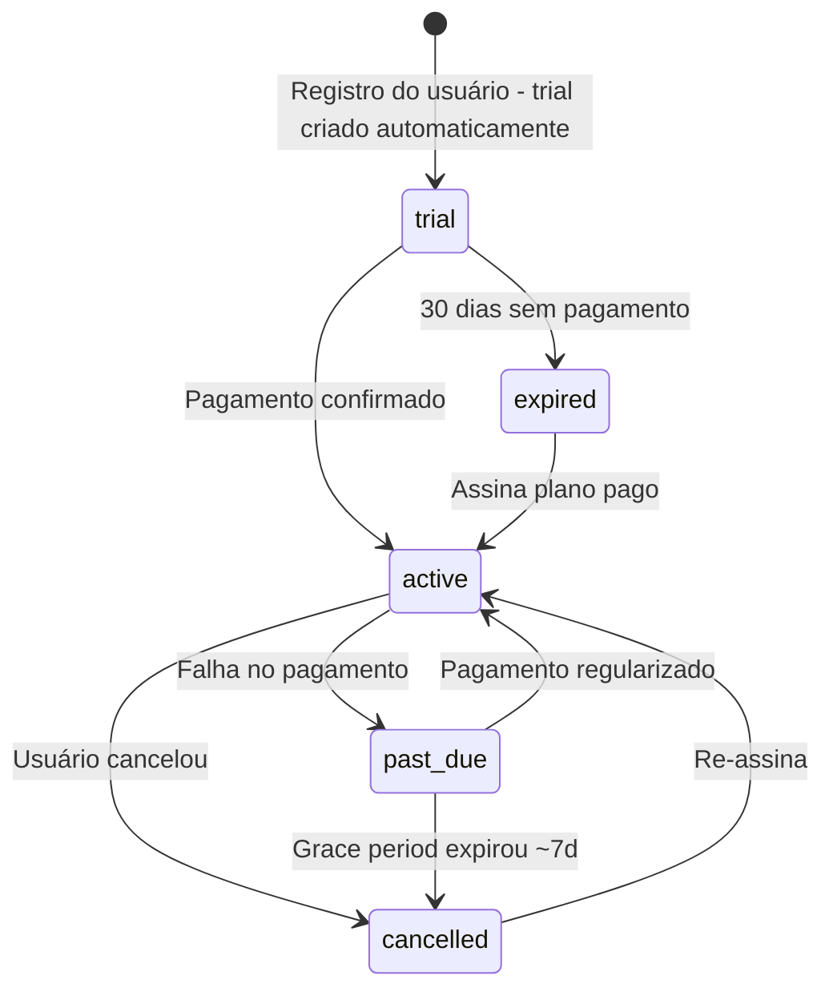

# Plano de Implementação — Sistema de Assinaturas Mercado Esperto

> Substitui `subscription-plan.md`. Baseado na análise do código atual e padrões existentes do projeto.

---

## Visão Geral

Implementar sistema de assinaturas com 3 tiers (Gratuito, Básico, Premium), trial automático de 30 dias no registro, controle de limites, integração Stripe com cartão de crédito (web) e IAP manual via plugin community (mobile).

## Planos

| | Gratuito (trial 30d) | Básico | Premium |
|---|---|---|---|
| **Preço** | R$ 0 | R$ 9,90/mês · R$ 99/ano | R$ 19,90/mês · R$ 199/ano |
| **Notas fiscais/mês** | 1 | 5 | Ilimitado |
| **Análises IA/mês** | 2 | 5 | Ilimitado |
| **Insights avançados** | ✅ (trial) | ❌ | ✅ |
| **Exportação CSV/PDF** | ❌ | ❌ | ✅ |
| **Suporte** | Email | Email | Prioritário |

---

## Fase 0 — Modelo de Dados

### 0.1 Subscription State Machine



### 0.2 Novo modelo — `Subscription` (`apps/api/src/models/subscription.py`)

```python
import enum
import uuid
from datetime import datetime, timezone
from typing import TYPE_CHECKING, Optional

from sqlalchemy import ForeignKey, String
from sqlalchemy.orm import Mapped, mapped_column, relationship

from src.database import Base

if TYPE_CHECKING:
    from src.models.user import User


class SubscriptionPlan(str, enum.Enum):
    FREE = "free"
    BASIC = "basic"
    PREMIUM = "premium"


class BillingCycle(str, enum.Enum):
    MONTHLY = "monthly"
    YEARLY = "yearly"


class SubscriptionStatus(str, enum.Enum):
    TRIAL = "trial"
    ACTIVE = "active"
    PAST_DUE = "past_due"
    CANCELLED = "cancelled"
    EXPIRED = "expired"


# Limites por plano: (invoices/mês, analyses/mês)
PLAN_LIMITS: dict[SubscriptionPlan, tuple[int | None, int | None]] = {
    SubscriptionPlan.FREE: (1, 2),
    SubscriptionPlan.BASIC: (5, 5),
    SubscriptionPlan.PREMIUM: (None, None),  # ilimitado
}


class Subscription(Base):
    __tablename__ = "subscriptions"

    id: Mapped[uuid.UUID] = mapped_column(primary_key=True, default=uuid.uuid4)
    user_id: Mapped[uuid.UUID] = mapped_column(
        ForeignKey("users.id"), unique=True, nullable=False, index=True
    )

    # Plano e ciclo
    plan: Mapped[str] = mapped_column(
        String(20), default=SubscriptionPlan.FREE.value, nullable=False
    )
    billing_cycle: Mapped[Optional[str]] = mapped_column(
        String(20), nullable=True
    )  # None para free/trial
    status: Mapped[str] = mapped_column(
        String(20), default=SubscriptionStatus.TRIAL.value, nullable=False
    )

    # Datas do trial
    trial_start: Mapped[datetime] = mapped_column(
        default=lambda: datetime.now(timezone.utc), nullable=False
    )
    trial_end: Mapped[datetime] = mapped_column(nullable=False)  # trial_start + 30d

    # Datas da assinatura paga
    current_period_start: Mapped[Optional[datetime]] = mapped_column(nullable=True)
    current_period_end: Mapped[Optional[datetime]] = mapped_column(nullable=True)
    cancelled_at: Mapped[Optional[datetime]] = mapped_column(nullable=True)

    # Stripe
    stripe_customer_id: Mapped[Optional[str]] = mapped_column(
        String(255), nullable=True, index=True
    )
    stripe_subscription_id: Mapped[Optional[str]] = mapped_column(
        String(255), nullable=True, unique=True
    )

    # IAP (mobile)
    iap_provider: Mapped[Optional[str]] = mapped_column(
        String(20), nullable=True
    )  # "apple" | "google"
    iap_original_transaction_id: Mapped[Optional[str]] = mapped_column(
        String(255), nullable=True
    )

    # Timestamps
    created_at: Mapped[datetime] = mapped_column(
        default=lambda: datetime.now(timezone.utc), nullable=False
    )
    updated_at: Mapped[datetime] = mapped_column(
        default=lambda: datetime.now(timezone.utc),
        onupdate=lambda: datetime.now(timezone.utc),
        nullable=False,
    )

    # Relationships
    user: Mapped["User"] = relationship(back_populates="subscription")
    payments: Mapped[list["Payment"]] = relationship(
        back_populates="subscription", lazy="noload"
    )

    # Computed helpers
    @property
    def is_active(self) -> bool:
        now = datetime.now(timezone.utc)
        if self.status == SubscriptionStatus.TRIAL.value:
            return now < self.trial_end
        if self.status == SubscriptionStatus.ACTIVE.value:
            return self.current_period_end is None or now < self.current_period_end
        if self.status == SubscriptionStatus.PAST_DUE.value:
            return True  # grace period — acesso mantido
        return False

    @property
    def plan_enum(self) -> SubscriptionPlan:
        return SubscriptionPlan(self.plan)

    @property
    def invoice_limit(self) -> int | None:
        return PLAN_LIMITS[self.plan_enum][0]

    @property
    def analysis_limit(self) -> int | None:
        return PLAN_LIMITS[self.plan_enum][1]
```

### 0.3 Novo modelo — `Payment` (`apps/api/src/models/payment.py`)

```python
import uuid
from datetime import datetime, timezone
from decimal import Decimal
from typing import TYPE_CHECKING, Optional

from sqlalchemy import ForeignKey, Numeric, String
from sqlalchemy.orm import Mapped, mapped_column, relationship

from src.database import Base

if TYPE_CHECKING:
    from src.models.subscription import Subscription


class Payment(Base):
    __tablename__ = "payments"

    id: Mapped[uuid.UUID] = mapped_column(primary_key=True, default=uuid.uuid4)
    subscription_id: Mapped[uuid.UUID] = mapped_column(
        ForeignKey("subscriptions.id"), nullable=False, index=True
    )

    # Valor
    amount: Mapped[Decimal] = mapped_column(Numeric(10, 2), nullable=False)
    currency: Mapped[str] = mapped_column(String(3), default="BRL", nullable=False)

    # Status: pending, succeeded, failed, refunded
    status: Mapped[str] = mapped_column(String(20), nullable=False)

    # Provider info
    provider: Mapped[str] = mapped_column(
        String(20), nullable=False
    )  # "stripe" | "apple" | "google"
    provider_payment_id: Mapped[Optional[str]] = mapped_column(
        String(255), nullable=True
    )

    # Datas
    paid_at: Mapped[Optional[datetime]] = mapped_column(nullable=True)
    refunded_at: Mapped[Optional[datetime]] = mapped_column(nullable=True)

    created_at: Mapped[datetime] = mapped_column(
        default=lambda: datetime.now(timezone.utc), nullable=False
    )

    # Relationships
    subscription: Mapped["Subscription"] = relationship(back_populates="payments")
```

### 0.4 Novo modelo — `UsageRecord` (`apps/api/src/models/usage_record.py`)

```python
import uuid
from datetime import datetime, timezone

from sqlalchemy import ForeignKey, Integer, UniqueConstraint
from sqlalchemy.orm import Mapped, mapped_column

from src.database import Base


class UsageRecord(Base):
    """Contagem mensal de uso por usuário."""

    __tablename__ = "usage_records"
    __table_args__ = (
        UniqueConstraint("user_id", "year", "month", name="uq_usage_user_year_month"),
    )

    id: Mapped[uuid.UUID] = mapped_column(primary_key=True, default=uuid.uuid4)
    user_id: Mapped[uuid.UUID] = mapped_column(
        ForeignKey("users.id"), nullable=False, index=True
    )
    year: Mapped[int] = mapped_column(Integer, nullable=False)
    month: Mapped[int] = mapped_column(Integer, nullable=False)  # 1-12

    invoices_count: Mapped[int] = mapped_column(Integer, default=0, nullable=False)
    ai_analyses_count: Mapped[int] = mapped_column(Integer, default=0, nullable=False)

    updated_at: Mapped[datetime] = mapped_column(
        default=lambda: datetime.now(timezone.utc),
        onupdate=lambda: datetime.now(timezone.utc),
        nullable=False,
    )
```

### 0.5 Alteração no `User` model

Adicionar apenas o relationship (sem campos redundantes):

```python
# Em apps/api/src/models/user.py — adicionar:
# TYPE_CHECKING import
from src.models.subscription import Subscription

# Novo relationship (1:1)
subscription: Mapped[Optional["Subscription"]] = relationship(
    back_populates="user", lazy="selectin", uselist=False
)
```

### 0.6 Alembic migration

Uma migration que cria as 3 tabelas (`subscriptions`, `payments`, `usage_records`) e adiciona o relationship no User.

---

## Fase 1 — Backend Core

### 1.1 Config — Novas variáveis (`apps/api/src/config.py`)

```python
# Subscription
ENABLE_SUBSCRIPTION_SYSTEM: bool = False  # Feature flag — ativar gradualmente
TRIAL_DURATION_DAYS: int = 30

# Stripe
STRIPE_SECRET_KEY: str = ""
STRIPE_WEBHOOK_SECRET: str = ""
STRIPE_BASIC_MONTHLY_PRICE_ID: str = ""
STRIPE_BASIC_YEARLY_PRICE_ID: str = ""
STRIPE_PREMIUM_MONTHLY_PRICE_ID: str = ""
STRIPE_PREMIUM_YEARLY_PRICE_ID: str = ""

# Apple IAP
APPLE_SHARED_SECRET: str = ""
APPLE_BUNDLE_ID: str = "com.mercadoesperto.app"

# Google Play
GOOGLE_PLAY_PACKAGE_NAME: str = "com.mercadoesperto.app"
GOOGLE_PLAY_SERVICE_ACCOUNT_JSON: str = ""  # path to JSON key

@property
def subscription_enabled(self) -> bool:
    return self.ENABLE_SUBSCRIPTION_SYSTEM
```

### 1.2 Schemas (`apps/api/src/schemas/subscription.py`)

```python
import uuid
from datetime import datetime
from decimal import Decimal
from typing import Optional

from pydantic import BaseModel, Field


class SubscriptionResponse(BaseModel):
    id: uuid.UUID
    plan: str
    billing_cycle: Optional[str] = None
    status: str
    trial_start: datetime
    trial_end: datetime
    current_period_start: Optional[datetime] = None
    current_period_end: Optional[datetime] = None
    cancelled_at: Optional[datetime] = None
    is_active: bool
    invoice_limit: Optional[int] = None
    analysis_limit: Optional[int] = None
    created_at: datetime

    class Config:
        from_attributes = True


class UsageResponse(BaseModel):
    invoices_used: int
    invoices_limit: Optional[int]  # None = ilimitado
    ai_analyses_used: int
    ai_analyses_limit: Optional[int]  # None = ilimitado
    month: int
    year: int


class CheckoutRequest(BaseModel):
    plan: str = Field(..., pattern="^(basic|premium)$")
    billing_cycle: str = Field(..., pattern="^(monthly|yearly)$")
    success_url: str
    cancel_url: str


class CheckoutResponse(BaseModel):
    checkout_url: str
    session_id: str


class PaymentResponse(BaseModel):
    id: uuid.UUID
    amount: Decimal
    currency: str
    status: str
    provider: str
    paid_at: Optional[datetime] = None
    created_at: datetime

    class Config:
        from_attributes = True
```

### 1.3 Dependencies — Middleware de limites (`apps/api/src/dependencies.py`)

```python
from datetime import datetime, timezone
from sqlalchemy import select

from src.config import settings
from src.models.subscription import Subscription, PLAN_LIMITS, SubscriptionPlan
from src.models.usage_record import UsageRecord


async def get_subscription(
    current_user: User = Depends(get_current_user),
    db: AsyncSession = Depends(get_db),
) -> Subscription:
    """Retorna a subscription ativa ou raise 403."""
    if not settings.subscription_enabled:
        return None  # Feature desligada — tudo liberado

    result = await db.execute(
        select(Subscription).where(Subscription.user_id == current_user.id)
    )
    sub = result.scalar_one_or_none()

    if not sub:
        raise HTTPException(
            status_code=status.HTTP_403_FORBIDDEN,
            detail="Nenhuma assinatura encontrada. Inicie seu trial gratuito.",
        )

    if not sub.is_active:
        raise HTTPException(
            status_code=status.HTTP_403_FORBIDDEN,
            detail=f"Assinatura {sub.status}. Renove para continuar.",
        )

    return sub


async def check_invoice_limit(
    current_user: User = Depends(get_current_user),
    db: AsyncSession = Depends(get_db),
) -> User:
    """Verifica se o usuário pode criar mais notas este mês."""
    if not settings.subscription_enabled:
        return current_user

    sub = await _get_active_subscription(current_user.id, db)
    if sub.plan == SubscriptionPlan.PREMIUM.value:
        return current_user  # ilimitado

    now = datetime.now(timezone.utc)
    usage = await _get_or_create_usage(current_user.id, now.year, now.month, db)
    limit = PLAN_LIMITS[SubscriptionPlan(sub.plan)][0]

    if limit is not None and usage.invoices_count >= limit:
        raise HTTPException(
            status_code=status.HTTP_429_TOO_MANY_REQUESTS,
            detail=f"Limite de {limit} notas fiscais/mês atingido. Faça upgrade.",
        )

    return current_user


async def check_analysis_limit(
    current_user: User = Depends(get_current_user),
    db: AsyncSession = Depends(get_db),
) -> User:
    """Verifica se o usuário pode solicitar mais análises de IA este mês."""
    if not settings.subscription_enabled:
        return current_user

    sub = await _get_active_subscription(current_user.id, db)
    if sub.plan == SubscriptionPlan.PREMIUM.value:
        return current_user

    now = datetime.now(timezone.utc)
    usage = await _get_or_create_usage(current_user.id, now.year, now.month, db)
    limit = PLAN_LIMITS[SubscriptionPlan(sub.plan)][1]

    if limit is not None and usage.ai_analyses_count >= limit:
        raise HTTPException(
            status_code=status.HTTP_429_TOO_MANY_REQUESTS,
            detail=f"Limite de {limit} análises de IA/mês atingido. Faça upgrade.",
        )

    return current_user


# --- helpers (private) ---

async def _get_active_subscription(
    user_id: uuid.UUID, db: AsyncSession
) -> Subscription:
    result = await db.execute(
        select(Subscription).where(Subscription.user_id == user_id)
    )
    sub = result.scalar_one_or_none()
    if not sub or not sub.is_active:
        raise HTTPException(
            status_code=status.HTTP_403_FORBIDDEN,
            detail="Assinatura inativa.",
        )
    return sub


async def _get_or_create_usage(
    user_id: uuid.UUID, year: int, month: int, db: AsyncSession
) -> UsageRecord:
    result = await db.execute(
        select(UsageRecord).where(
            UsageRecord.user_id == user_id,
            UsageRecord.year == year,
            UsageRecord.month == month,
        )
    )
    usage = result.scalar_one_or_none()
    if not usage:
        usage = UsageRecord(user_id=user_id, year=year, month=month)
        db.add(usage)
        await db.flush()
    return usage
```

### 1.4 Incrementar contadores de uso

Após criar uma invoice com sucesso:
```python
# Em routers/invoices.py — após persistir a invoice
usage = await _get_or_create_usage(current_user.id, now.year, now.month, db)
usage.invoices_count += 1
```

Após executar uma análise de IA:
```python
# Em tasks/ai_analysis.py — após gerar análise
usage = await _get_or_create_usage(user_id, now.year, now.month, db)
usage.ai_analyses_count += 1
```

### 1.5 Router — Subscriptions (`apps/api/src/routers/subscriptions.py`)

| Método | Path | Descrição |
|--------|------|-----------|
| GET | `/` | Retorna subscription + usage do mês atual |
| POST | `/trial` | Fallback: cria trial para usuários existentes pré-subscription (migração) |
| POST | `/checkout` | Cria sessão Stripe Checkout (apenas cartão) → retorna URL |
| POST | `/portal` | Cria sessão Stripe Customer Portal → retorna URL |
| POST | `/cancel` | Cancela assinatura (marca cancelled_at, Stripe cancela no fim do período) |
| GET | `/payments` | Histórico de pagamentos |
| POST | `/webhooks/stripe` | Webhook Stripe (sem auth, verificado via signature) |
| POST | `/webhooks/apple` | Webhook Apple Server Notifications V2 (sem auth) |
| POST | `/webhooks/google` | Webhook Google RTDN (sem auth) |

### 1.6 Service — Stripe (`apps/api/src/services/stripe_service.py`)

> **Método de pagamento**: Apenas cartão de crédito para assinaturas recorrentes. Pix/Boleto não suportam subscription mode no Stripe.

```python
import stripe
from datetime import datetime, timezone
from src.config import settings

stripe.api_key = settings.STRIPE_SECRET_KEY

PRICE_MAP = {
    ("basic", "monthly"): settings.STRIPE_BASIC_MONTHLY_PRICE_ID,
    ("basic", "yearly"): settings.STRIPE_BASIC_YEARLY_PRICE_ID,
    ("premium", "monthly"): settings.STRIPE_PREMIUM_MONTHLY_PRICE_ID,
    ("premium", "yearly"): settings.STRIPE_PREMIUM_YEARLY_PRICE_ID,
}


class StripeService:

    @staticmethod
    async def create_checkout_session(
        user_email: str,
        user_id: str,
        plan: str,
        billing_cycle: str,
        success_url: str,
        cancel_url: str,
        stripe_customer_id: str | None = None,
    ) -> stripe.checkout.Session:
        price_id = PRICE_MAP.get((plan, billing_cycle))
        if not price_id:
            raise ValueError(f"Preço não configurado para {plan}/{billing_cycle}")

        params = {
            "mode": "subscription",
            "payment_method_types": ["card"],  # Apenas cartão para recorrência
            "line_items": [{"price": price_id, "quantity": 1}],
            "success_url": success_url,
            "cancel_url": cancel_url,
            "metadata": {"user_id": user_id, "plan": plan},
            "allow_promotion_codes": True,
        }

        if stripe_customer_id:
            params["customer"] = stripe_customer_id
        else:
            params["customer_email"] = user_email

        return stripe.checkout.Session.create(**params)

    @staticmethod
    async def create_portal_session(
        stripe_customer_id: str, return_url: str
    ) -> stripe.billing_portal.Session:
        return stripe.billing_portal.Session.create(
            customer=stripe_customer_id,
            return_url=return_url,
        )

    @staticmethod
    async def cancel_subscription(stripe_subscription_id: str) -> None:
        """Cancela no fim do período atual (não imediato)."""
        stripe.Subscription.modify(
            stripe_subscription_id,
            cancel_at_period_end=True,
        )

    @staticmethod
    def verify_webhook_signature(payload: bytes, sig_header: str) -> dict:
        """Verifica assinatura do webhook. Raise ValueError se inválido."""
        return stripe.Webhook.construct_event(
            payload, sig_header, settings.STRIPE_WEBHOOK_SECRET
        )
```

### 1.7 Service — Webhook Handler (`apps/api/src/services/subscription_service.py`)

Lógica central de atualização de subscription baseada em eventos:

| Evento Stripe | Ação |
|---|---|
| `checkout.session.completed` | Vincula stripe_customer_id, atualiza plan/status para active, registra Payment |
| `invoice.payment_succeeded` | Atualiza current_period_start/end, registra Payment(succeeded) |
| `invoice.payment_failed` | Muda status para past_due, registra Payment(failed) |
| `customer.subscription.updated` | Sincroniza plan/billing_cycle/período |
| `customer.subscription.deleted` | Muda status para cancelled |

Cada handler é **idempotente** — usa `provider_payment_id` como chave para evitar duplicatas.

### 1.8 Exceptions

Adicionar em `apps/api/src/exceptions.py`:

```python
class SubscriptionError(MercadoEspertoException):
    """Raised when subscription operation fails."""
    pass

class UsageLimitExceededError(MercadoEspertoException):
    """Raised when user exceeds plan limits."""
    pass
```

### 1.9 Auto-trial no registro (obrigatório)

Todo novo usuário recebe trial automaticamente ao registrar. No `routers/auth.py`, após criar o User, criar a Subscription:

```python
from datetime import timedelta

trial_end = datetime.now(timezone.utc) + timedelta(days=settings.TRIAL_DURATION_DAYS)
subscription = Subscription(
    user_id=user.id,
    plan=SubscriptionPlan.FREE.value,
    status=SubscriptionStatus.TRIAL.value,
    trial_end=trial_end,
)
db.add(subscription)
```

> **Decisão**: Trial é automático, não existe endpoint separado para "iniciar trial". O endpoint `POST /trial` no router serve apenas como fallback para usuários existentes que ainda não têm subscription (migração).

---

## Fase 2 — Frontend Web

### 2.1 Tipos TypeScript (`apps/web/src/types/index.ts`)

```typescript
// Subscription Types
export interface SubscriptionResponse {
  id: string;
  plan: "free" | "basic" | "premium";
  billing_cycle: "monthly" | "yearly" | null;
  status: "trial" | "active" | "past_due" | "cancelled" | "expired";
  trial_start: string;
  trial_end: string;
  current_period_start: string | null;
  current_period_end: string | null;
  cancelled_at: string | null;
  is_active: boolean;
  invoice_limit: number | null;
  analysis_limit: number | null;
  created_at: string;
}

export interface UsageResponse {
  invoices_used: number;
  invoices_limit: number | null;
  ai_analyses_used: number;
  ai_analyses_limit: number | null;
  month: number;
  year: number;
}

export interface CheckoutRequest {
  plan: "basic" | "premium";
  billing_cycle: "monthly" | "yearly";
  success_url: string;
  cancel_url: string;
}

export interface PaymentResponse {
  id: string;
  amount: number;
  currency: string;
  status: string;
  provider: string;
  paid_at: string | null;
  created_at: string;
}
```

### 2.2 Hook (`apps/web/src/hooks/useSubscription.ts`)

- `useSubscription()` — GET `/subscriptions` (React Query, staleTime: 30s)
- `useUsage()` — GET `/subscriptions/usage`
- `useCheckout()` — POST `/subscriptions/checkout` → redireciona para URL
- `useCancelSubscription()` — POST `/subscriptions/cancel`
- `usePayments()` — GET `/subscriptions/payments`

### 2.3 Páginas e Componentes

| Componente | Localização | Descrição |
|---|---|---|
| **PricingPage** | `/pricing` | 3 cards com planos, CTA para checkout |
| **SubscriptionSettings** | `/settings/subscription` | Status atual, botão cancelar, histórico pagamentos |
| **UsageBanner** | `components/subscription/usage-banner.tsx` | Barra de progresso mostrando uso do mês |
| **UpgradeModal** | `components/subscription/upgrade-modal.tsx` | Modal quando usuário atinge limite |
| **TrialBanner** | `components/subscription/trial-banner.tsx` | "X dias restantes no trial" |

### 2.4 Proteção de rotas client-side

No hook principal, se `subscription.is_active === false`, redirecionar para `/pricing` com banner explicativo.

---

## Fase 3 — Mobile IAP

> **Pré-requisito**: Fases 0-2 completas e validadas em produção.

### 3.1 Backend — Receipt Validation

Criar `apps/api/src/services/iap_service.py`:

- **Apple**: Usar App Store Server API v2 (não o endpoint legacy `verifyReceipt`). Validar JWS signed transactions.
- **Google**: Usar Google Play Developer API v3 (`purchases.subscriptions.get`). Autenticar via service account.

Ambos devem:
1. Validar autenticidade do receipt/token
2. Atualizar Subscription (plan, status, current_period_start/end, iap_provider, iap_original_transaction_id)
3. Registrar Payment

### 3.2 Endpoints IAP

| Método | Path | Descrição |
|---|---|---|
| POST | `/subscriptions/iap/verify` | Frontend envia receipt → backend valida e atualiza subscription |
| POST | `/subscriptions/iap/restore` | Restaurar compras anteriores |

### 3.3 Frontend Mobile — Plugin Manual

Usar `@capacitor-community/in-app-purchases` (plugin community) com implementação manual:

```typescript
// apps/web/src/services/iap.ts
import { InAppPurchase2 } from '@capacitor-community/in-app-purchases';
import { Capacitor } from '@capacitor/core';

const PRODUCT_IDS = {
  basic_monthly: 'com.mercadoesperto.basic.monthly',
  basic_yearly: 'com.mercadoesperto.basic.yearly',
  premium_monthly: 'com.mercadoesperto.premium.monthly',
  premium_yearly: 'com.mercadoesperto.premium.yearly',
};

export class IAPService {
  private static initialized = false;

  static async initialize(): Promise<void> {
    if (!Capacitor.isNativePlatform() || this.initialized) return;
    await InAppPurchase2.initialize();
    this.initialized = true;
  }

  static async getProducts() {
    await this.initialize();
    return InAppPurchase2.getProducts({
      productIds: Object.values(PRODUCT_IDS),
    });
  }

  static async purchase(productId: string) {
    await this.initialize();
    const result = await InAppPurchase2.purchase({ productId });
    // Enviar receipt ao backend para validação server-side
    const response = await fetch('/api/v1/subscriptions/iap/verify', {
      method: 'POST',
      headers: { 'Content-Type': 'application/json' },
      body: JSON.stringify({
        platform: Capacitor.getPlatform(), // 'ios' | 'android'
        receipt: result.receipt,
        product_id: productId,
      }),
    });
    return response.json();
  }

  static async restorePurchases() {
    await this.initialize();
    const purchases = await InAppPurchase2.restorePurchases();
    // Enviar ao backend para re-validar
    const response = await fetch('/api/v1/subscriptions/iap/restore', {
      method: 'POST',
      headers: { 'Content-Type': 'application/json' },
      body: JSON.stringify({
        platform: Capacitor.getPlatform(),
        purchases: purchases.items,
      }),
    });
    return response.json();
  }
}
```

**Trade-offs do plugin manual vs RevenueCat:**
- (+) Sem custo adicional (RevenueCat cobra 1% acima de $2.5k/mês)
- (+) Controle total do fluxo
- (-) Mais código para manter (cache offline, retry, edge cases)
- (-) Sem dashboard de revenue analytics (usar Stripe Dashboard + App Store Connect)

### 3.4 Billing Cross-Platform

```typescript
// apps/web/src/lib/billing.ts
import { Capacitor } from "@capacitor/core";

export function getPaymentMethod(): "stripe" | "iap" {
  if (Capacitor.isNativePlatform()) {
    return "iap";
  }
  return "stripe";
}
```

---

## Fase 4 — Compliance e Segurança

### 4.1 Stripe Webhook Security

- Verificar `Stripe-Signature` header em TODO webhook
- Registrar apenas os eventos necessários no dashboard Stripe
- Usar endpoint dedicado sem autenticação JWT (verificação via signature)
- **Método de pagamento**: Apenas cartão de crédito (Pix/Boleto não permitem cobrança recorrente automática via Stripe)

### 4.2 LGPD

- Dados de pagamento sensíveis ficam no Stripe (não armazenar cartão localmente)
- Endpoint para exportar dados do usuário (inclui histórico de pagamentos)
- Endpoint para deletar conta — cancela subscription antes

### 4.3 Código de Defesa do Consumidor

- Cancelamento a qualquer momento sem multa
- Reembolso automático se cancelamento nos primeiros 7 dias (Art. 49 CDC)
- Cancelamento efetivo ao fim do período pago (não imediato)

### 4.4 Feature Flag

`ENABLE_SUBSCRIPTION_SYSTEM = False` por padrão. Quando `False`:
- Todas as dependencies de limite retornam sem verificar
- Tudo funciona como antes (acesso total)
- Permite deploy gradual

---

## Checklist de Implementação

### Fase 0 — Modelo de Dados
- [ ] Criar `apps/api/src/models/subscription.py`
- [ ] Criar `apps/api/src/models/payment.py`
- [ ] Criar `apps/api/src/models/usage_record.py`
- [ ] Adicionar relationship `subscription` no `User` model
- [ ] Registrar modelos no `__init__.py`
- [ ] Criar migration Alembic
- [ ] Aplicar migration e validar schema

### Fase 1 — Backend Core
- [ ] Adicionar configs de Stripe e subscription no `config.py`
- [ ] Adicionar configs no `.env.example` e `docker-compose.yml`
- [ ] Criar `apps/api/src/schemas/subscription.py`
- [ ] Criar exceptions `SubscriptionError` e `UsageLimitExceededError`
- [ ] Implementar dependencies `check_invoice_limit`, `check_analysis_limit`
- [ ] Criar `apps/api/src/services/stripe_service.py`
- [ ] Criar `apps/api/src/services/subscription_service.py` (webhook handler)
- [ ] Criar `apps/api/src/routers/subscriptions.py` (todos os endpoints)
- [ ] Registrar router no `main.py`
- [ ] Adicionar auto-trial no registro (`routers/auth.py`)
- [ ] Integrar `check_invoice_limit` no `routers/invoices.py`
- [ ] Integrar `check_analysis_limit` no `tasks/ai_analysis.py`
- [ ] Incrementar contadores em `UsageRecord` nos pontos certos
- [ ] Testes unitários para dependencies de limite
- [ ] Testes unitários para subscription_service (webhook handling)
- [ ] Testes de integração para fluxo completo (trial → checkout → active)

### Fase 2 — Frontend Web
- [ ] Adicionar tipos TypeScript em `types/index.ts`
- [ ] Criar hook `useSubscription.ts`
- [ ] Criar página `/pricing` com cards dos 3 planos
- [ ] Criar seção de subscription em `/settings`
- [ ] Criar componente `UsageBanner`
- [ ] Criar componente `UpgradeModal` (disparado ao atingir limite)
- [ ] Criar componente `TrialBanner`
- [ ] Integrar proteção de rotas (redirect para `/pricing` se expirado)
- [ ] Testar fluxo Stripe Checkout (modo sandbox)

### Fase 3 — Mobile IAP (plugin manual)
- [ ] Implementar `iap_service.py` (Apple receipt + Google token validation)
- [ ] Criar endpoints `/subscriptions/iap/verify` e `/iap/restore`
- [ ] Instalar `@capacitor-community/in-app-purchases`
- [ ] Implementar `IAPService` com purchase + restore + receipt forwarding
- [ ] Implementar billing cross-platform (`getPaymentMethod()`)
- [ ] Configurar produtos no App Store Connect e Google Play Console
- [ ] Testar em sandbox Apple e Google
- [ ] Testar em dispositivos reais

### Fase 4 — Compliance e Go-Live
- [ ] Implementar reembolso automático (7 dias)
- [ ] Endpoint de export de dados (LGPD)
- [ ] Revisar termos de serviço
- [ ] Configurar produtos no Stripe Dashboard (apenas cartão)
- [ ] Configurar produtos no App Store Connect e Google Play Console
- [ ] Ativar feature flag `ENABLE_SUBSCRIPTION_SYSTEM = True`
- [ ] Monitor de métricas: trial → active conversion rate

---

## Arquivos Novos (resumo)

| Arquivo | Tipo |
|---|---|
| `apps/api/src/models/subscription.py` | Model |
| `apps/api/src/models/payment.py` | Model |
| `apps/api/src/models/usage_record.py` | Model |
| `apps/api/src/schemas/subscription.py` | Schema |
| `apps/api/src/services/stripe_service.py` | Service |
| `apps/api/src/services/subscription_service.py` | Service |
| `apps/api/src/services/iap_service.py` | Service (Fase 3) |
| `apps/api/src/routers/subscriptions.py` | Router |
| `apps/api/alembic/versions/xxx_add_subscription_tables.py` | Migration |
| `apps/web/src/hooks/useSubscription.ts` | Hook |
| `apps/web/src/app/pricing/page.tsx` | Page |
| `apps/web/src/components/subscription/usage-banner.tsx` | Component |
| `apps/web/src/components/subscription/upgrade-modal.tsx` | Component |
| `apps/web/src/components/subscription/trial-banner.tsx` | Component |

## Arquivos Modificados (resumo)

| Arquivo | Mudança |
|---|---|
| `apps/api/src/models/user.py` | Adicionar relationship `subscription` |
| `apps/api/src/models/__init__.py` | Registrar novos models |
| `apps/api/src/config.py` | Adicionar configs Stripe/subscription |
| `apps/api/src/dependencies.py` | Adicionar `check_invoice_limit`, `check_analysis_limit` |
| `apps/api/src/exceptions.py` | Adicionar `SubscriptionError`, `UsageLimitExceededError` |
| `apps/api/src/main.py` | Registrar router de subscriptions |
| `apps/api/src/routers/auth.py` | Auto-criar subscription trial no registro |
| `apps/api/src/routers/invoices.py` | Integrar Depends `check_invoice_limit` |
| `apps/api/src/tasks/ai_analysis.py` | Integrar check de limite de análises |
| `apps/web/src/types/index.ts` | Adicionar tipos de subscription |
| `.env.example` | Adicionar variáveis Stripe |
| `docker-compose.yml` | Adicionar environment vars Stripe |
